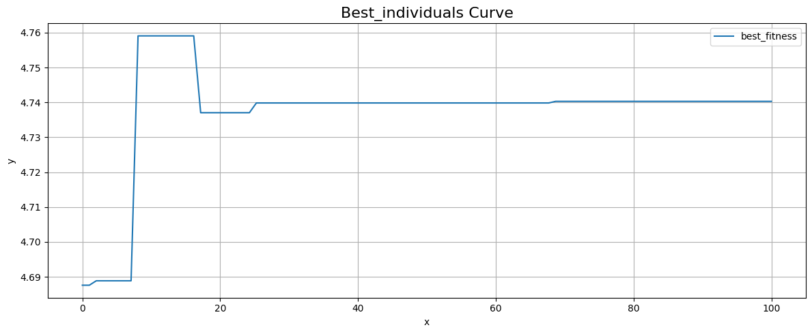

# 遗传算法求最值问题实验报告

## 遗传算法的基本原理

遗传算法是一种模拟达尔文生物进化论的自然选择和遗传学原理的优化算法。其基本原理归纳如下：

1. **编码**：在遗传算法开始之前，问题的解决方案被编码成一定长度的染色体，通常是二进制字符串。
2. **初始群体**：算法随机生成一个初始种群，这个种群由多个染色体（即潜在的解决方案）组成。
3. **适应度函数**：定义一个适应度函数来评价种群中每个个体的适应度，即它们的解决问题的能力。适应度越高的个体被认为是越好的解决方案。
4. **选择**：根据个体的适应度进行选择。适应度高的个体更有可能被选中用于下一代的繁殖。
5. **交叉**：模拟生物的杂交过程，交叉是遗传算法中的一种重要操作。它通过混合两个父代染色体的基因来产生新的后代。
6. **变异**：通过随机改变个体染色体中的一个或多个基因来引入新的遗传材料，保证种群不会陷入局部最优解。
7. **新一代**：通过选择、交叉和变异生成的新个体构成新的种群。这个过程会不断重复，种群会逐渐向更优解进化。
8. **终止条件**：算法继续迭代直到满足特定的终止条件，如达到最大迭代次数、适应度达到要求的阈值或适应度长时间未改善等。

遗传算法利用了自然选择的“优胜劣汰”原理和基因的交叉与变异原理，使得种群能够不断进化，最终趋向于最优解。这种基于群体的搜索策略有效地平衡了解空间的全局搜索和局部探索能力，因而能够在各种复杂的优化问题中找到高质量的解。

遗传算法的流程图图下图所示：


遗传算法的伪代码如下所示：
```
1. 初始化参数：
   max_generations := 最大迭代次数
   population_size := 种群大小
   crossover_rate := 交叉概率
   mutation_rate := 变异概率

2. 定义适应度函数 fitness_function(individual)
   // 根据问题定义，计算一个个体的适应度

3. 创建初始种群：
   population := 随机生成 population_size 个个体

4. for generation in 1 to max_generations do
      // 评估当前种群中每个个体的适应度
      fitness_values := 计算 population 中每个个体的适应度 fitness_function(individual)

      // 选择操作：基于适应度选择个体用于繁殖
      parents := 选择 population 中的个体基于 fitness_values

      // 交叉操作：在父代个体中进行配对并交叉，生成后代
      offspring := 空集合
      for i in 1 to population_size/2 do
         parent1, parent2 := 选择 parents 中的一对个体
         child1, child2 := 执行交叉 parent1 和 parent2 用 crossover_rate
         将 child1 和 child2 添加到 offspring

      // 变异操作：对后代进行随机变异
      for individual in offspring do
         执行变异 individual 用 mutation_rate

      // 生成新的种群
      population := parents 并集 offspring

      // 可选：保存最佳个体或者进行其他种群管理操作

   end for

5. 返回最佳解或者整个种群
```

## 初始值的设置对结果的影响

### 问题一：哪些影响

在遗传算法中，交叉概率和变异概率是两个核心参数，它们对算法的性能和求解过程产生深远影响。下面分别讨论这两个参数的影响：

1. 交叉概率（Crossover Probability）:
   - 高交叉概率
     - 促进基因多样性：高交叉概率意味着种群中的个体有更多机会与其他个体交换基因，这有助于在种群中创造出更多的基因多样性。
     - 加速收敛：由于基因的广泛交换，算法可能更快地找到问题的优化区域，从而加速解决方案的收敛。
     - 破坏优秀解：同时，过高的交叉概率可能导致优秀个体的优质基因被破坏，因为太频繁的基因重组可能会分解良好的基因组合。
   - 低交叉概率
     - 缓慢进化：如果交叉概率太低，新的个体可能就是父代的近乎完全复制品，这会限制种群的进化速度。
     - 降低多样性：基因交换的减少可能导致种群多样性的降低，增加早熟收敛到局部最优解的风险。
2. 变异概率（Mutation Probability）:
   - 高变异概率
     - 增加多样性：变异是引入新特征的主要方式，高变异率可以增加种群的遗传多样性，有助于算法跳出局部最优。
     - 防止早熟收敛：通过引入新的基因变体，高变异率可以帮助防止算法过早收敛到非最优解。
     - 过度随机化：然而，过高的变异率可能导致种群过于随机，解决方案可能在搜索空间中随机漫游，而无法有效地收敛。
   - 低变异概率
     - 稳定性：低变异率可以帮助维持优秀个体的基因，减少优质解被破坏的风险。
     - 可能的早熟收敛：如果变异率太低，可能不足以防止算法陷入局部最优解，特别是在解决复杂或具有众多局部最优的问题时。

综上所述，交叉概率和变异概率需要根据问题的特性和算法的实际表现进行仔细调整。没有一种通用的最佳设置，它们的最佳值通常是通过实验和问题分析得出的。过高或过低的这些参数都可能妨碍遗传算法找到一个有效的全局最优解。在实践中，经常需要进行多次试验和调整，以找到特定问题的最佳参数设置，**详见问题二的叙述**。

### 问题二：如何设置

在使用遗传算法进行求解时，正确设置交叉概率和变异概率是至关重要的，因为它们直接影响到算法的搜索能力和收敛性能。以下是一些指导原则和方法，可以帮助你设置这些参数：

1. **经验设置**:
   - **交叉概率**: 通常，交叉概率被设置为相对较高的值，例如0.6至0.9，以促进有用基因的传播和种群多样性的保持。
   - **变异概率**: 变异概率通常设置得较低，例如0.01至0.1，因为过高的变异率可能导致过度探索和算法收敛的随机性。
2. **问题相关性**:
   - 了解你要解决问题的性质很重要。对于一些复杂的问题，可能需要更高的变异率来避免局部最优。而对于一些相对简单或者解空间平滑的问题，较高的交叉率和较低的变异率可能更适合。
3. **适应性方法**:
   - 一些高级的遗传算法使用自适应方法来动态调整交叉和变异率，这基于当前种群的表现。例如，如果种群的多样性下降，算法可能会自动增加变异率。
4. **实验调优**:
   - 参数设置通常需要多次实验来确定。通过观察算法在不同参数设置下的表现，你可以逐渐调整它们以获得最佳表现。设计实验时，可以使用参数敏感性分析、网格搜索或贝叶斯优化方法。
5. **参考文献**:
   - 查看相关研究和文献来了解类似问题上成功应用的参数设置。通过学习先前的研究，你可以获得关于可能的最佳参数范围的初始见解。
6. **使用启发式规则**:
   - 一些研究提出了启发式规则来设置参数，例如，当种群规模较大时，可能需要较低的交叉和变异率，因为大的种群本身就提供了更多的多样性。
7. **并行试验**:
   - 如果资源允许，可以并行运行多个算法实例，每个实例使用不同的参数组合。在一系列运行后，选择表现最佳的参数组合。

需要注意的是，不存在一种通用的“最佳”设置，因为最有效的参数设置取决于特定的问题和算法实现。因此，通常需要通过实验来确定适用于特定问题的最佳参数配置。同时，参数设置不仅仅是一个一次性的过程，而是一个持续的过程，可能需要根据算法的长期表现进行调整。

## Python代码实现

> Python代码的编写使用Jupyter Notebook进行，所以在报告中进行分段展示。

```python
import numpy as np
import matplotlib.pyplot as plt


# 目标函数
def objective_function(x):
    return 10 * np.sin(5*x) + 7 * np.abs(x-5) + 10

# 参数
npop = 100  # 种群数量
ngen = 100  # 进化代数
mutation_rate = 0.1  # 变异概率
crossover_rate = 0.8  # 交叉概率
lb, ub = 0, 10  # 变量x的范围

# 生成初始种群
population = np.random.uniform(lb, ub, npop)
fitness = objective_function(population)

best_fitness = []
best_individuals = []

# 进化过程
for gen in range(ngen):
    # 选择：轮盘赌选择法
    fitness_prob = fitness / np.sum(fitness)
    selected_parents = np.random.choice(population, size=npop, p=fitness_prob)
    
    # 交叉
    children = []
    for i in range(0, npop, 2):
        p1, p2 = selected_parents[i], selected_parents[i+1]
        if np.random.rand() < crossover_rate:
            child1 = p2
            child2 = p1
        else:
            child1, child2 = p1, p2
        children.extend([child1, child2])
    children = np.array(children)
    
    # 变异
    mutation_mask = np.random.rand(npop) < mutation_rate
    mutation_values = np.random.uniform(-1, 1, npop) * mutation_mask
    children = children + mutation_values
    children = np.clip(children, lb, ub)  # 确保子代在定义域内
    
    # 替换
    total_population = np.concatenate([population, children])
    total_fitness = objective_function(total_population)
    idx = np.argsort(total_fitness)[:npop]  # 选择适应度最好的个体
    population = total_population[idx]
    fitness = total_fitness[idx]
    
    # 记录每代的最佳适应度和个体
    best_fitness.append(fitness[0])
    best_individuals.append(population[0])
    # 最佳适应度曲线
    plt.figure(figsize=(12, 5))
    x_index = np.linspace(0, 100, 100)

    plt.title('Best_fitness Curve', fontsize=16)
    plt.plot(x_index, best_fitness, label="best_fitness")
    plt.xlabel("x")
    plt.ylabel("y")
    plt.legend()
    plt.grid(True)

    plt.tight_layout()
    plt.show()
    
```


```python
# 最佳个体曲线
plt.title('Best_individuals Curve', fontsize=16)
plt.plot(x_index, best_individuals, label="best_fitness")
plt.xlabel("x")
plt.ylabel("y")
plt.legend()
plt.grid(True)

plt.tight_layout()
plt.show()
```



```python
# 结果
best_fitness, best_x = best_fitness[-1], best_individuals[-1]

best_fitness, best_x
```

Console输出：

```
(1.9151576579498766, 4.741060612805114)
```

```python
# 可视化
x = np.linspace(lb, ub, 1000)
y = objective_function(x)

plt.figure(figsize=(12, 5))

# 函数可视化
plt.plot(x, y, label="Target Function")
plt.scatter([best_x], [best_fitness], color="red")
plt.title(f"Minimum: x={best_x:.2f}, y={best_fitness:.2f}")
plt.xlabel("x")
plt.ylabel("y")
plt.legend()
plt.grid(True)

plt.tight_layout()
plt.show()
```


