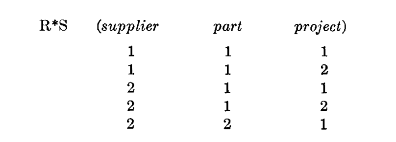

# 大型共享数据库中的数据关系模型

未来的大型数据库的用户必须得到保护，以免他们需要了解数据在机器中是如何组织的（内部表示）。一个提供此类信息的提示服务并非一个令人满意的解决方案。当数据的内部表示发生变化，甚至当一些外部表示的方面发生变化时，终端用户的活动和大多数应用程序应保持不受影响。由于查询、更新和报告流量的变化以及存储信息类型的自然增长，数据表示的变化通常是必需的。现有的非推理、格式化数据系统为用户提供了树结构文件或稍微更通用的网络数据模型。在第1节中，讨论了这些模型的不足。介绍了基于n-ary关系的模型、数据库关系的正规形式，以及通用数据子语言的概念。在第2节中，讨论了关系上的某些操作（除逻辑推理外），并将其应用于用户模型中的冗余和一致性问题。

关键词：

data bank，data base，data structure，data organization，hierarchies of data，networks of data，relations，derivability，redundancy，consistency，composition，join，retrieval language，predicate calculus，security，data integrity

## 1.关系模型和标准形式

### 1.1 简介

本论文关注的是将基本关系理论应用于提供对格式化数据大银行共享访问的系统。除了Childs的一篇论文[1]外，关系在数据系统中的主要应用是用于演绎性问答系统，Levein和Maron(2)提供了该领域工作的大量参考文献。

相比之下，这里处理的问题是数据独立性问题——应用程序和终端活动不受数据类型增长和数据表示变化的影响，以及某些类型的数据不一致问题，这些问题预计即便在非演绎系统中也会变得令人头痛。

在第一部分讨论的数据关系视图（或模型），基于当下流行的非推理系统应用的图或网状模型[3,4]。提供了数据自身自然结构的意义描述，不包括任何服务器组织目的的结构信息。一方面，在应用系统之间提供一个基础的、高层次的数据库语言，另一方面，在应用程序和服务器组织形式提供最大的独立性。

关系模式一个长远优势是它声明了一个处理可导出性，冗余和关系一致性提供基础原理，这些将在第二部分中讨论。在网络模型中，已经产生了一些混淆，不仅是其对关系起源的连接起源的误解（见第二部分中的“连接陷阱”）。

最后，关系模型允许格式化数据系统在范围和逻辑上进行清晰地估算限制，并且在一个独立系统中的数据竞争展示的关系优势（逻辑角度）。这些清晰观点的样例也在论文中多处引用。支持关系模型的系统实现未在本文讨论。

### 1.2 当前系统中的数据依赖

当前信息开发系统中的数据表体现了数据依赖目标的主要优势[5，6，7]。这些数据表使得在数据库中改变数据的特定属性变得容易。然而，一些应用系统中，很多数据表现属性的修改限制并没有减少。未来，用户之间的数据模型依然是杂乱的表现属性，特别是在数据集合的表现上（和独立实体相比）。需要移除的三种主要的数据依赖有：排序依赖，索引依赖和访问路径依赖。在一些系统中，这三种依赖并没有严格分离。

#### 1.2.1 排序依赖。

在数据库中，数据的元素可能以多种方式存储，一些不涉及到排序，一些需要每个元素统一排序，其他的要求每个元素多种排序。让我们考虑下这些已存在的系统中，那些要求或需要数据元素存储至少有一个统一排序，并和物理上的顺序一致。比如，一个文件的多个部分可能按部分序号升序存储。这些系统一般允许应用程序假设文件记录的展示顺序完全（部分）和存储顺序一致。这些依靠文件存储顺序的应用系统在重新排序时会操作失败。比如利用指针记录存储顺序。

没必要以具体某个系统为例，因为当下所有知名的信息系统都没有明确区分展示顺序和存储顺序。如何提供此类独立性的有效实现问题亟待解决。

#### 1.2.2 索引依赖。

在格式化数据环境中，索引往往是有效的提升数据检索性能方法。在提升查询和更新的响应速度的同时，也降低了插入和删除的响应速度。从信息角度，索引是数据展示中多余的组件。如果一个系统只使用索引，并且其在数据库中的修改操作环境表现良好，则需要具备一次次创建和销毁索引的能力。那么问题来了：应用系统和终端用户是否可以在目录变化中保持不变？

当前格式化数据库系统采用多种不同方法进行索引。TDMS[7]无条件地在每个属性上添加索引。最新发版的IMS[5]为用户提供每一个文件的选择：没有索引（分层联系组织）或只在主键创建索引（分层索引连续组织）。无论是那种形式用户的应用程序都不用逻辑依赖这些无条件提供的目录。IDS[8]，允许文件设计者选择需要索引的属性或者合并索引到文件结构中，从而产生更多的链。通过这些索引获得性能提升的应用系统必须使用索引名称来引用这些索引。如果这些索引被删除，这些应用将无法正确运行。

#### 1.2.3 访问路径依赖。

当前格式文件系统为用户提供树形结构的文件或更通用的网状数据模型。当这些树或者网状模式结构变化时，应用程序将会面临逻辑损坏。下面举一个简单例子。

假设数据库中包含part和project的数据。每一个part有编号，名称，描述，库存量，订单量和记录等属性。每一个project有 编号，名称，描述信息和记录等属性。每当一个project使用了一个具体的part，该part提交给指定project的量也需要记录。假设系统要求用户或文件设计者定义或声明该数据在树形结构中的关系。分层结构中的任何一种都适用上述信息。

结构1 Project 隶属于Parts

```text
file    segment     fields
F       PART        part #
                    part name
                    part desription
                    quantity-on-hand
                    quantity-on-order
        PROJECT         project #
                        project name
                        project description
                        quantity committed
```

结构2 Part 隶属于 Project

```text
file    segment     fields
 F      PROJECT     project #
                    project name
                    project description
        PART            part #
                        part name
                        part desription
                        quantity-on-hand
                        quantity-on-order
                        quantity committed
```

结构3 Part和Project对等，交易关系隶属于Project

```text
file    segment     fields
 F      PART        part #
                    part name
                    part desription
                    quantity-on-hand
                    quantity-on-order
 G      PROJECT     project #
                    project name
                    project description
                    quantity committed
        PART            part #
                        quantity committed
```

结构4 Part 和Project对等，交易关系隶属于Part

```text
file    segment     fields
 F      PART        part #
                    part name
                    part desription
                    quantity-on-hand
                    quantity-on-order
        PROJECT         project
                        quantity committed
 G      PROJECT     project #
                    project name
                    project description
```

结构5 Part，Project ，交易关系对等

```text
file    segment     fields
 F      PART        part #
                    part name
                    part desription
                    quantity-on-hand
                    quantity-on-order
 G      PROJECT     project #
                    project name
                    project description
 H      COMMIT      part #
                    project #
                    quantity committed
```

现在，考虑打印出project值为“alpha”的project下的每一个part编号，名称和库存量。以下的观察可以发现无论选择哪一种树形结构都可以解决这个问题。如果程序P是开发出来解决这个问题并使用上面提到的5种数据结构其中之一。且程序P未进行测试哪一种结构更有效。更明确地说，如果P使用结构5成功，则使用其他4个的结构会失败；如果P使用3或4成功，则使用1，2和5失败；如果P使用结构1或2成功，则3，4，5失败。原因很简单，缺少一个结构是有效的验证测试，P失败是因为尝试去访问一个不存在的文件（可用系统认为这是一个错误）或者没有对包含期望信息发起访问。没有明白的读者应该开发一个这样的验证程序。

所以，一般来说，开发一个应用程序来验证系统允许的所有树形结构是不现实的，这些程序在结构必须发生改变时会面临失败。

为用户提供网状模型的系统也面临类似的问题。在树形和网状情况中，用户（用户程序）被要求开发一套数据访问路径的集合。和这些路径是否和存储组织的指针定义是否一致没有关系。在IDS中这个一致非常简单，在TDMS恰恰相反。忽略存储形式的重要意义是终端用户和应用程序和持续存在的用户访问路径上保持独立。

一种解决办法是建立一个原则：用户定义的访问路径在用户未废弃之前这个访问路径也不能废弃。这样的原则不现实，因为在整个模型中用户访问数据的路径会变成非常庞大。

### 1.3 关系数据模型

本文使用的关系一词为公认的数学概念。给出集合 S1，S2 … Sn（不需要唯一），如果存在某个n-元组集合R，他的每个元组的首个元素是来自S1，第二个元素来自S2，以此类推，则称R为这些集合上的关系。我们以Sj为R的第j个域。如上面的定义，R 则称为n度。一度关系常称为unary，二度为binary，三元为ternary，n度为n-ary。（注：可简单理解R为笛卡尔积S1 X S2 X S3…Sn的子集）。

进一步解释，我紧接着应用关系的数组形式，必须声明的是特定的表示并不是关系视图的本质部分。描述多维数据关系R的有以下特性：

（1）每一行表示R中的一个n元组

（2）行的顺序是不重要的。

（3）每一行是唯一的。

（4）列的顺序是非常重要的。取决于R中对域的定义S1,S2,…Sn（后文标注有有序域和无序域）

（5）每列的意义通过使用对应的域名称来定义。

图1中的样例是一个4度的关系，称为supply，反映了part从指定supplier运输到指定projects的过程。


图1 一个4度关系

有人会问：如果列是以对应的域名来标记，为什么列的顺序很重要？如表2所示，两列可能有相同的开头（相同的域名）但是在关系中表示不同的意义。关系的组成部分称为组件。这是一个三元关系，前两列是part，第三列是量。组件（x，y，z）是part x是part y的直接（子集）组件，z个part x的组成一个part y。这个关系在描述part扩散问题中起了重要作用。


图2 一个关系包含相同的域

值得注意的是很多已有的信息系统（主要是基于树形结构文件），当其有两个或者更多相同的域时，都无法提供数据关系的体现。IMS/360[5]当前的版本就是如此。

一个数据库里面的全量数据可被看作随时间变化的关系结合。这些关系有多种度。随着时间推移，每一个n维关系可能成为插入额外n-元组的内容，删除已有的和修改当前已经存在的n元组。

在很多商业，政府，科学领域的数据库中，一些关系的度非常高（一个30的度很不常见）。用户一般不用花精力去记住任何关系中的域的顺序（比如，supplier排序，然后part，然后project，关系supply中的库存量）。相应地，我们建议用户订单中不包含有序的域关系，但是包含无序域的副本（注：对于任何写入或者接收到计算机系统的数据，用户如果理解这些的意义，一般在后续对这些数据会有更多的利用）。为了达到这个目标，域必须在给出关系中是唯一定义的，不需要使用位置。于是，如果出现2个或者更多相同的域定义，我们要求在每个域名称必须使用一个惟一的角色名，在给出的关系中扮演唯一标识的作用。例如，在图2的组件关系中，第一个域part可以用角色名sub，第二个用super，如此，用户可以这样处理组件和域：sub.part,super.part,quantity,无须关系这些域之间的顺序。

总的来说，建议用户应和包含时间变化的关系集合的数据关系模型进行交互，而不是关系。每个用户不需要知道名称和域之外更多的信息（角色定义一直都需要）。尽管这些信息可能在系统中由于用户的需求以菜单的形式提供（受限于安全和隐私的要求）。

对于一个数据库，有很多种方法来声明数据模型。为了讨论一个更好的方式（或者通用方式），我们首先要介绍一些额外组件（活跃域，主键，外键，非单值域），以及一些当前系统系统中开发过程中使用的术语。在本论文的后面的内容中，非特殊说明，我们不需要刻意区分relation和relationship的准确含义。

假设一个数据库中包含了parts，projects和suppliers的关系。其中一个关系part定义了以下域：

part 编号，part 名称，part 颜色，重量，库存，订单库存

以及一些额外的域。每一个域都包含一系列值，部分或者全部的域在数据库中时刻都可能发生变化。可以想象的是，在某些瞬间，所有的part颜色都存在，不太可能是所有的part重量，名称，数量也都存在。我们可以称这些已经存在的值的集合为在那一瞬间的动态域。

一般来说，一个给定关系中的域（或域组合）对其中的每个元素（n元组）进行了唯一定义。这样的域或组合域称为主键。在上面的例子中，part编号可以是主键，而颜色不是。一个主键是唯一的，他可以是一个简单域或者每个子域没有唯一性约束的组合域。一个关系中可能出现多个主键。比如在上面例子中不同的part总是拥有不同的名称。当一个关系中拥有2个或者更多的唯一主键，则他们其中一个将作为这个关系的主键。

一个常见的需求是关系中的一个元素相互参照了同关系里的另一个元素或其他关系中的元素。索引用来表示用户角度的意义（不仅仅是意义）的这种参照关系。当关系R中的域不是主键，但是他的值是另一个关系的主键，则我们称这个域为外键（foreign key）。（不包含关系S和R是同一个的情况）。在图1的supply关系中，supplier，part，project组合是主建，同时这三个域单独开来分别也是外键。

这之前的研究中，非常趋向于将数据库中的数据组成分为两个部分，一部分是实体的组成描述（比如suppliers的描述）和各个实体之间关系（比如supply关系）。当某个关系存在外键时这个差别很难处理。在用户的关系模型中，也许这个区分没有任何的好处，（也许会有一些优势，除非是将用户的关系集合和物理表示方式对应起来）。

目前为止，我们已经讨论了在简单域上面的关系定义。简单域指域的元素是原子的（不可分解的）的值。非原子值会在关系框架中讨论。以下域可能有将关系视为元素。这些关系可能别定义在非简单域，等等。例如，关系employee中的一个可能定义为salary history的域。slary history域中的一个元素是域date和slavry上的个二度关系。在任何时间点上，因为员工的存在，数据库中会有很多slary history的关系实体。相反的是，只有一个employee关系的实体。

术语属性和重复的数据组在已有的数据库技术中非常类似于简单域和非简单域。当前很多对术语的误解是因为未能区分类型和实例（在记录中）以及区分用户数据模型的组件与服务器组成方式（参考record样例）。


### 1.4标准格式

如上面讨论到的，在一个关系中，所有的简单列都可以使用二维数组来存储。对于包含一个活多个非简单域的关系需要一些更复杂的数据结构。因为这个原因（以及下面引用到的），非简单域被排除的可能性需要进一步分析。事实上，一个最简单的排查流程，我们可以称为标准化。

例如，如图3所示的关系集合。Job history 和children 是关系employee中的非简单域。Salary history 是关系job history中的非简单域。图3中的树形结构表示了这些非简单域之间的关系。


图3（a）未格式化集合


图3（b）格式化集合

标准化过程如下。从树形的顶部的关系开始，使用关系的主键，并将主键域或组合域扩展到从属关系中。每个被扩展的关系中的的主键由从父级拷贝的主键。现在，剔除所有从父关系中的非简单域，删除树的根节点，对剩下的子节点重复这个流程。

图3（a）中的关系集合标准化的结果如图3b所示。每个关系的主键展示了关系是如何标准化扩展的。

如果上述的标准是适用的。那关系集合的反标准化必须满足以下条件：

（1）非简单域的关系图是一个树的集合

（2）不存在复杂域作为主键

笔者知道没有应用对放松对这些限制条件。更多的标准化操作成为可能，在本文不做讨论。

当关系使用标准格式来展现，简单的数组形式变成可行的，这不仅有利于存储也有利于使用各种形式的系统之间的数据交互。信息通信格式将适用于数组的压缩版本，并具备以下优势：

（1）避免指针（地址值或偏移量）

（2）防止依赖hash寻址模式

（3）不包含目录或有序队列

如果用户的关系模型采用标准格式创建，数据库中的数据项名称可以使用更简单的格式。通用的格式可以使是

R(g).r.d

R是关系名称；g为生成标识（可选）；r是角色名称（可选）；d是域名称。当给出的关系存在或者期望存在多个生成方式时，g是需要的。当关系R有2个或更多域名为d，则需要角色r。简单的表示R.d通常是够用的。

### 1.5 语言方面

上文讨论的数据关系模型，允许开发一个通用的基于实用谓语的数据语言。如果关系集合是标准化的，则一阶谓语可以满足。在多主机语言（程序，命令行，问题导向）环境中，这个语言为所有涉及的数据提供一个语言能力的标准，其自身也可以成为一个重要的候选嵌入语言（实现语法修改）。本文的目的不是去描述这个语言的细节，它重要的特性如下。

让我们用R表示数据子语言，H作为主机语言。R定义了关系和域。每一个关系的定义了关系的主键。已声明的关系将被拥有对应权限的用户加入到系统目录中，H允许声明的定义支持，或者永久存在，这些关系如何在存储中组织。R允许从数据库检索任意子集。这些检索操作动作受限于安全约束。

数据语言的普遍性体现在他的描述能力（而不是计算能力）。在一个大型数据库中，每一个数据子集都可能有非常多的描述，尽管我们假设系统用于检索数据时只会存在有限的函数过程集合。于是，这些可以用于规格的运算表达式必须拥有对良好格式化的应用运算表达式的描述能力。众所周知的是，要实现这个描述能力，没必要去展开么一个公式（无论选择哪种语言）。例如，前束标准格式就可以满足[9]。

算术函数在条件或其他检索语句是需要的。这些函数可以在H中定义，在R中调用。

一个指定的集合可能只被查询访问到，也可能被修改使用到。向已声明的关系插入新的元素而不关心其在服务器存储顺序。在已声明的关系中删除指定元素将对信息交互带来影响（和个体用户相反或局部交互）。如果删除和更新依赖于R中指定的关系，一些删除和更新可能由其他动作触发。

一个重要的影响是，这个语言中用于检索的数据视图是数据的元素和集合的名称。在前面已经讨论一部分这些问题。在常见的网络视图中，用户常常要使用比需要更多的关系名称，因为名称和路径相关（或者路径类型）而不是关系相关。

一旦用户发现某个确定的关系被存储，他期望可以使用任意组合的已知参数来访问数据，而其他则为未知，因为信息（例如最高点）本身就存在。这是一个系统特性（在当前很多系统中并没有），我们可以称为（逻辑上）对称关系利用。当然，在性能场景，对称是不期望的。

为了支持面向单个二维关系的对称利用，两个直接路径是需要的。对于一个深度为n的关系，可以命名和控制的路径数量是n的阶乘。

再一次，如果一个关系视图中每个n维关系（n>2）被用户用于表达时只使用二维关系（见Feldman's LEAP System），于是，2n-1个名称需要被制模，而不是在1.2小节描述的n+1个n维符合。例如，表1中的一个4维关系supply，包含了5个n维符号，可以用以下表达式：

P（supplier，Q（part，R（project，quantity）））

在嵌套二维符号，于是包含了7个名称。

这种表达式进一步的不足就是不对称。虽然这种不对称不会阻止对称检索，但会使用户在表达一些基本检索事变得很麻烦。（考虑一下，例如，查询一些某个给定项目Q和关系R中的parts和quantities）。

### 1.6 可描述的，可命名的和存储关系

一个数据库相关的有两个关系集合：命名集合和表达式集合。命名集合是用户可以通过意义简单命名的交互关系组合。关系R在命名集合中要求关系用户在声明R时具备特定权限；当用户取消对R的声明时候关系随之消失。

表达式集合是关系的全集，可以在数据语言中进行设计。这些表达式由命名集合中的关系的简单名称组成；生成名称，角色和域；逻辑连接；谓语积分的量词；以及特定表达式子集-通常为一个很小的子集。

当命名集合中的一些关系在集合中根据其他关系组合随时间变化的，考虑将集合中的语句集合来定义这些时间依赖约束。我们在介绍了多种关系操作后再讨论这个问题。

对于数据系统设计来说，主要的面对的问题之一是如何选择存储方式支持的关系模型。概念上讲，多种多样的数据形式需要足够多以满足安装时所有集合要求的性能要求。过多的分类将导致额外的存储负载和不断重新解释当前结构的描述。

对于很多已选的存储形式，数据系统必须提供在当前存储系统中关系模型数据语言中转换用户请求的表达式和有效动作。从更高的角度，数据语言是一个设计问题挑战。然而，这个问题必须得到解决-当数据库中更多的数据被用户访问，提供有效响应和吞吐问题从单个用户问题转化为数据系统问题。

## 2.冗余和一致性

### 2.1 关系操作

因为关系是集合，所有的常见集合操作也适用于关系。然而，结果不一定是关系；例如，一个二维关系和一个三维关系的并集不是一个关系。

以下讨论的操作特指关系。这些操作被介绍的原因是他们derive在源于其他关系中的关键角色。他们的主要应用是在未提供逻辑推理服务的非推理信息系统，，尽管在加入这些服务时他们的可用性不需要废弃。

大部分用户不需要直接关心这些操作。数据系统设计者和数据库控制者应该关注，无论如何，熟悉这些操作。

#### 2.1.1 置换

一个二维关系用两列数组来表示。交换这两列则得到相反的关系。更普通的，如果一个n维关系的列发生了这样的置换操作，结果得到这关系称为这个给定关系的置换。例如，在图1中 4！=24 是关系supply的置换，如果我们包含了置换的定义，且列的顺序没有发生改变。

由于用户的关系模型由关系（无序域关系）的集合组成，置换对于一个关系隔离级别的模型是没有较大意义的。然而，模型的存储形式的考虑是非常有意义的。在提供对称开发关系的系统中，存储关系定义的可应答查询组合和这个关系的其他置换的可应答相同。尽管在逻辑上是没必要存储关系和他的置换信息，从性能角度出发是可以考虑的。

#### 2.1.2 投射

假设现在我们选择了一个关系中特定的一些列（除去其他的），然后把结果数组中重复项删除。最终的数组展示了一个给定关系的投射。

选择操作π用于获得任意期望的置换，投射或者两者的组合。于是，如果L是目录k的列表 L=i1，i2，。。。ik。R是一个n维关系（n≥k），πl（r）是k维关系，其中第j列是R（j=1,2,3,…k）中的列ij，删除结果中重复的列。如图1中的关系supply。这个关系的置换投射展示在图4。注意，在这个特殊场景，投射比从他分离的关系包含更少的n-元组。

#### 2.1.3 连接

假设我们现在有两个包含常见域的二维关系。在那种情况下，我们可以联合这些关系来形成一个包含所有信息的三位组合关系。

表5的例子中，关系R和S可以连接并不丢失任何信息，同时表6展示了R和S的连接。当存在一个三维关系U且π12（U）=R π23（U）=S，则二维关系R和二维关系S是可连接的。任何这样的二维关系成为R和S的join。如果二维关系R，S满足 π2（R）=π1（S），则R和S是可连接。在这种情况总是存在的R和S的自然连接定义为：

R*S={(a,b,c):R(a,b) ^ S(b,c)}

当R（a,b）值为True，如果（a,b）是关系R的元素，同样也是S（b,c），于是

π12（R*S)=R 和 π23（R*S）=S

注意，在图6是R和S的在图5的自然连接。另一个连接显示在图7.


图4 对图1中的关系进行置换连接


图5 可连接关系



图6 R和S的自然连接（图5）


图7 R 和 S的另一种连接

这些关系暴露了域part（join的域）的一个元素，包含了在R 和S之间的一个join过程的属性。这个元素发起了多数的join。在join域中这样的元素称为在R和S之间的连接歧义点。

如果π21（R）或S是一个函数（二维关系且是1：1，n：1，而不是1：n），在R和S的join操作不会出现歧义点。在这样的情况下，R和S的自然连接是他们之间仅有的。需要注意的是反复的“R 和S”的限制是需要的，因为s可能可join于S（R也可join于S），这个join可以作为一整个区分考虑。在图5中，R, π21(R)，S，π（S）都不是函数。

对其他关系来说，R和S在连接中的歧义点有的时候是可以解析的。假设我们现在有或者可以发现R和S的独立依赖源，关系T在域project和supplier具有以下特性
$$
(1) \pi_1(T)=\pi_2(S)\\
(2) \pi_2(T)=\pi_1(R)\\
(3) T(j, s) \rightarrow \exists p(R(S, p) \wedge S(p, j))\\
(4) R(s, p) \rightarrow \exists j(S(p, j) \wedge T(j, s))\\
(5) S(p, j) \rightarrow \exists_s(T(j, s) \wedge R(s, p))\\
$$
然后我们可以定义关系R,S,T三种join关系，一个三维关系如下：π12(U) =R, π23(U) =S,π31(U) =T.

这样的join将被称为循环join以区分四维关系V的行内join: π12(V) =R, π23(V) =S,π31(V) =T.

如果可能存在不止一个循环join存在（如表8，9），循环语句将产生比2-join更多的强约束。需要特别指出的是，关系R,S,T必须遵循R和S（x点），S 和T（y点），T和 R（z点）中产生模糊点。进一步说，y必须是关系S下的一个关系x，z是T下面一个关系y，x是R下的关系z.在表8中，点x=a;y=d,z=2具备这个属性。


图8，具备循环连接的二维关系


图9 图8中3-join循环关系

对二维关系R,S,T进行自然行内3-join表示如下。

R*S*T = {(a, b,c,d):R (a, b)^S(b,c) ^ T(c,d)}

左边不需要括号的元素是2-join自然连接是组合的。为了实现循环计数部分，我们介绍操作y,通过打印所有的结尾在一起，从一个深度为n的关系中产生一个深度为n-1的关系。预算，如果R是一个n维关系（n≥2），R的连接定义为：
$$
\begin{array}{r}
\gamma(R)=\left\{\left(a_1, a_2, \cdots, a_{n-1}\right): R\left(a_1, a_2, \cdots, a_{n-1}, a_n\right)\right. \left.\wedge a_1=a_n\right\}
\end{array}
$$
我们现在可以用一下的表达式来定义R,S,T的循环3-join的定义

r（R\*S\*T）

线性，循环3-join概念和一个n 二维数组进行join的自然副本扩展是很明显的。需要一些额外的解释，考虑到关系的join在二维中不需要。两个关系R(深度r)，S（深度s）在他们的域p上进行join的场景（p<r，p<s）。简单来说，假设第一个p域是关系R中最后一个r域中的p，是关系R中s域的第一个p。如果不是这样，我们通过应用若干置换来实现。现在，取关系R中的第一个r-p域的笛卡尔积，并命名为新域A。取R中最后一个p域的笛卡尔积，称为B。取关系S最后一个s-p域的笛卡尔积称为C。

如果他是域A,B上的一个二维关系，我们称为R。如果他是域BC 上的一个二维关系，我们称为S。线性和循环join的概念可以直接应用。类似的方法也可以用到线性和二维数组上，对于一个n-join的组合深度。

#### 2.1.4 composition-组合

读者可能对函数合成的概念很熟悉。我们可以讨论下如何生成并先应用到二维数组。我们对合成和合成能力的定义是直接基于对join和join能力的定义。

假设给出两个关系R,S。T是R和S的组合，如果存在一个R和S的连接U，T=π13（U），于是，如果当他们是可连接时这两个关系称为可组合的。然而，R和S之间存在的更多连接并不表示他们之间有更多的组合。

基于R 和S之间的自然连接是R，S直接的合成定义如下

R·S=π13（R*S）

就图5中的关系R,S来说，他们的自然组合展示在图10，另一个合成在图11（从图7分化而来）。


图10 R和S的自然组合


图11 R和S的另一种组合

当存在2个或更多的join存在时，不同的组合可能只有一个或者和不同的join方式相同。图12展示两个关系有多个joins但只有一个合成的例子。注意，模糊点c不存在于R和S的合成中，因为非模糊关系产生了a，b，d，e。


图12 多种join，仅一种组合

关系对的合成扩展并不是需要二维（不同深度）包含同样的join对扩展。

对关系组合里面的理解缺乏导致很多系统设计者陷入连接陷阱。这个陷阱将在下面的例子里面分析。假设每个supplier描述都使用指针和part的描述相关联，每个part的描述也一样通过指针和每个project的描述连接起来。可以得出一个结论，一般地，错误地命名，如果跟随一个给定的supplier所有可能的路径的part，某人可能得到一个非法的这个supplier提供的所有project的集合。这个结论只会在以下特定的场景是正确的，比如project和suppliers之间的目标关系，在事实上，其他两个关系的自然合成-我们必须标准地加上短语（永远），因为这经常被应用在路径依赖的技术中。

#### 2.1.5 restriction-限制

一个关系的子集也是关系。关系S通过和关系进行限制操作可以生成一个R的子集。这个操作就是限制函数生成一个关系子集的过程，定义如下：

令 L,M为两个长度相同的列表，L=i1,i2,….ik,M=j1，j2，。。。jk 当k≤R和S的度。于是L,M是S在R上的限制且Rl|mS是R的最大子集：
$$
\pi_L\left(R^{\prime}\right)=\pi_M(S)
$$
只有当相同的操作应用在R和S上这个定义才成立。

图13中的关系R，S，R’满足等式 R’ = R(2,3)|(1,2)S.


图13 限制样例

现在我们就应该考虑关系操作的各种应用系统了。

### 2.2 redundancy-冗余

关系的命名集合的冗余必须和存储集合的冗余区分开。我们这里主要是考虑模型问题。我们首先要对关系的可导性做一个明确的定义。

假设q是关系上的操作集合，每一个操作都有一个操作数属性产生一个唯一关系（于是自然连接是可行的，join不行）。如果q中总是存在一个操作序对于关系R是对关系S集合不可导的，从R中导出S的成员。短语“总是”使用到的原因是我们在处理时间变化的关系，而且我们对包含一段时间区的关系的可导性更感兴趣。对于非推理性系统中的命名关系集合，会存在一个适当的集合Q包含了一下操作：置换，自然连接，约束和限制。置换是不相干的，自然组合需要被包含进去。由于使用一个自然连接是被允许的，之后是一个映射。对于存储集合的形式，会存在一个操作集合q2包含了置换和更多的子操作和合并关系操作，置换和连接他们的元素。

#### 2.2.1 强冗余

如果一个关系集包含至少一个投射过程的关系，这个投射是由这个集合中的其他关系到导出，这这个关系集为强冗余。以下的两个例子试图解释强冗余的定义，并展示在实际的应用方式。在第一个例子中，关系集合包含以下关系：

employee（serial#，name，manager#，manamername）

其中serial为主键，manager为外键。我们用n表示活跃域，
$$
\begin{aligned}
&\Delta_t(\text { manager\# }) \subset \Delta_t(\text { serial\# })\\
&\Delta_t(\text { managername }) \subset \Delta_t(\text { name })
\end{aligned}
$$
对于任意时间t，在这个场景下冗余是很常见的：managername域是不需要的。可见这是一个强冗余定义，我们假设


在第二个例子中，关系集中包含关系S描述了suppliers，主键为s#，关系D描述departments，主键为D，关系j 描述project 主键为j，以及以下关系：


在每个场景中，除了s，dj的符号域。我们假设条件C是维持时间独立性的条件：supplier s 提供department d（关系P），当且近当supplier s 提供一些project j（关系Q），关联到D（关系R），于是，我可以写下一下等式:


因此这是一个强冗余

命名关系集的强冗余存在的一个重要原因是用户便利性。一个具体的场景是对于一些相似属性的保留使得老系统可以正常使用这个属性。对于命名集的强冗余的了解，使得系统或者数据库设计者在面向选择存储方式上有了更大的选择空间，如此来有效地处理系统负载。如果命名集的强冗余直接反映到存储集的强冗余（或者其他存储集的强冗余），一般来说，在面对集中处理单元，对于一些查询来说需要额外的存储空间和更新时间。

#### 2.2.2 弱冗余

另一个冗余模式可能存在。和强冗余对比起来，他不是特征对等的。如果一个关系集合包含不是从其他关系导出的关系，但在任意时间，某些这个关系集中其他关系投射的join导出，则这个关系集合是弱冗余的。

我们可以用上面的第二个例子来说明下弱冗余性。假设条件c并不是一直存在，关系π12(P),π12(Q),π12(R)是复杂的关系，在任意时间点都可能出现两个关系的连接。在这些情况下，没有任何一个是由其他两个导出。然而，他们之间不存在约束。因为每一个都是他们三个之间的循环join的投射。一个弱冗余可以符号化：对于任意时间，π12(P)是π12(Q)和π12(R)的一些组合。合成问题可能是自然连接也可能不是。

一般来说，弱一致性对用户固有存在的逻辑需求。他们不会被系统或者数据管理删除。他们总是存在，存在于命名集合和存储集合。

### 2.3 一致性

无论何时命名集的冗余都是多余的，我们可以一个定义了所有冗余并包含了成员集合直接依赖的语句集合。如果信息系统丢失-总是是发生-每一个命名关系的详细语义信息，则它不能减少应用对命名集的冗余。当过一段时间，尝试去减少冗余，但是这些尝试也会失败。

给出集合时间依赖关系C，相关集合Z,包含依赖语句和C的瞬间值V，我们称状态（C，Z，V）一致或非一致性，取决于V是否满足Z。比如，给定存储关系R,S,T包含依赖语句“π12(T)为π12(R)和π12(S)的合成”，我们不断地检查R,S,T中存储的值是否满足这个约束。这个检测算法，先定义了R,S,T的前两列（无论如何他们存在系统中），用于判断以下等式：

（1）π1(T)=π1(R)

（2）π2(T)=π2(S)

（3）对于关系π12（T）中的每一个元素对（a，c），关系π12（R）中存在一个关系（a,b）,且（b，c）存在于π12（S）中。

对于具体问题（此处不讨论）如何获取一个关系集合的快照。其中的一部分会非常大和高可用。

上面一致性的定义非常重要的是关于一个数据库的瞬间状态，以及这个状态的依赖。于是，具体来说，理论上不会出现用户生成了一个非一致源于疏忽和委托行为。下面的例子讲解释这个一致性问题。

假设关系集包含关系S，J，D，P，Q，R，其中P,Q,R提供了强冗余或弱冗余（考虑到具体情况，不需要关系具体是哪一种冗余）。假设在时间t，数据库的状态是一致的，不包含project j，supplier 2 提供project j且j关联到department 5.于是，当向p中插入一些元素后，不存在组合（2，5）在π12（P）中。此时，用户向插入了（2，3）到关系π12（P）中，数据库的状态是一致的。非一致状态可能会因为忽略引起，假设输入的（2，5）是正确的，存在一个由2个supplier提供project 2关联department 5，在这个情况下，用户可能会在未来向关系Q,R中插入数据，也就是（2，j）插入π12（Q），（5，j）到π12（R）。另一方面，输入的（2，5）可能是错误的，可能是由于用户期望插入一些元素到P中，一个元素的插入可能从一个状态到另一个一致性状态。关键在于如果不询问环境（可能是用户创建这个不一致），系统将无法解决这个问题。

当然，系统发现会有多种方式探测到不一致并作出响应。一种方法是系统在每次插入，删除和更新时，检测可能出在的不一致。正常来说，这个检测会减低操作的效率。如果一个产生了不一致，详细信息将记录下来，如果在一个可接受的时间内没有得到补救，负责安全或敏感的用户要引起注意。另一个方法是定义一致性检测为一种操作性，周期执行。输入导致不一致，如果系统保存了所有的状态变化事务，则在检测时可以发现这不一致。后面的方法在非一致发生较少的情况下更合适。

### 2.4 总结

在第一部分，提出了数据库关系模型基础理论，用于保护格式化数据系统的用户可能面对的数据库破坏问题，在数据库中的增长和负载引起的变化。提出了一个标准的时间变化关系集合格式。

在第二部分，定义了关系操作和两个类型的冗余，以及如何处理数据一致性状态的问题。这些和常见数据库中不同实际问题不同数据类型混合在一起。

许多问题提出来当没有解答。例如，在1.4小节中，只提及了一小部分重要的数据语言属性。这个语言的完整语法和实现问题并没有讨论。然而，提出的材料应该对于经验丰富的系统程序员实现多种方法来说是充足的。同时也希望本文可为格式化数据库系统更精细的研究做出贡献。

答谢。IBM poughkeepsie 的C.T.Davies 使作者相信未来信息系统中对数据依赖的必要性。同时感谢F.P.Palermo，C.P.Wang，E.B.Altman和M.E.Senko来自IBM San Jose 研究院提供的有意义的讨论。

## 参考文献

**1.**CHILDS, D. L. Feasibility of a set-theoretical data structure -a general structure based on a reconstituted definition of relation. Proc. IFIP Cong., 1968, North Holland Pub. Co., Amsterdam, p. 162-172.

**2.**LEVEIN, R. E., AND MARON, M. E. A computer system for inference execution and data retrieval. Comm. ACM 10, 11 (Nov. 1967), 715-721.

**3.**BACHMAN, C. W. Software for random access processing. Datamation (Apr. 1965), 36-41.

**4.**McGEE, W. C. Generalized file processing. In Annual Review in Automatic Programming 5, 13, Pergamon Press, New York, 1969, pp. 77-149.

**5.**Information Management System/360, Application Description Manual H20-0524-1. IBM Corp., White Plains, N. Y., July 1968.

**6.**GIS (Generalized Information System), Application Description Manual H20-0574. IBM Corp., White Plains, N. Y., 1965.

**7.**BLEIER, R. E. Treating hierarchical data structures in the SDC time-shared data management system (TDMS). Proc. ACM 22nd Nat. Conf., 1967, MDI Publications, Wayne, Pa., pp. 41-49.

**8.**IDS Reference Manual GE 625/635, GE Inform. Sys. Div., Pheonix, Ariz., CPB 1093B, Feb. 1968.

**9.**CHURCH, A. An Introduction to Mathematical Logic I. Princeton U. Press, Princeton, N.J., 1956.

**10.**FELDMAN, J. A., AND ROVNER, P.D. An Algol-based associative language. Stanford Artificial Intelligence Rep. AI-66, Aug. 1, 1968.