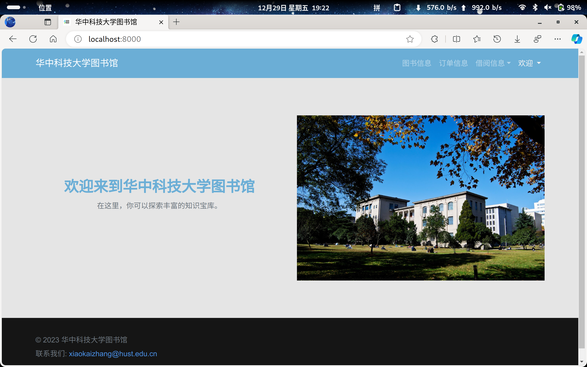
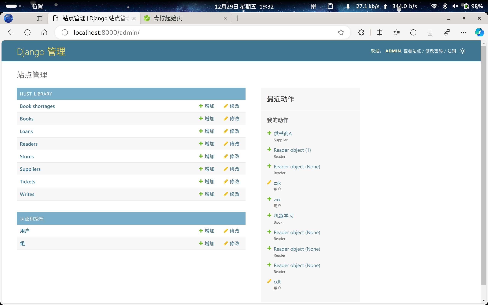
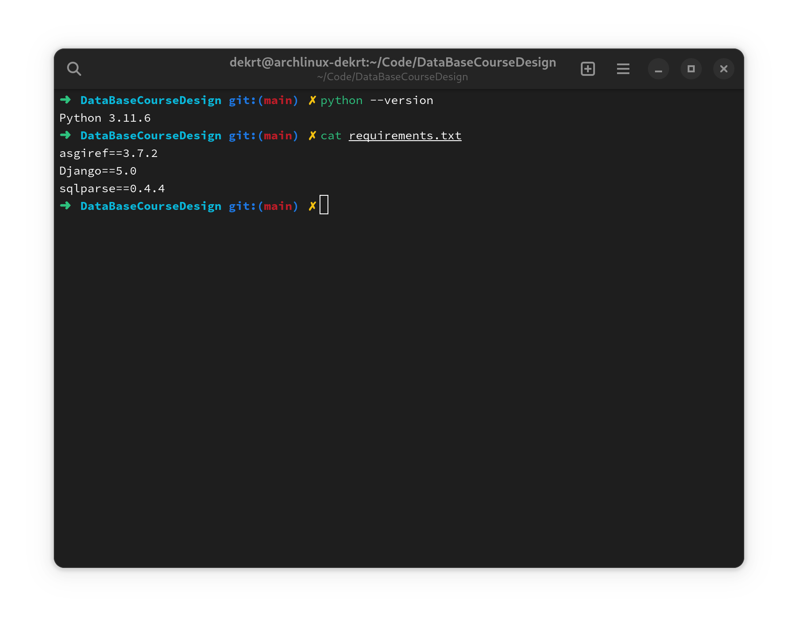

# 数据库系统原理课程设计(2023)

## 概述

> 详情请参考课程设计报告







## 运行

使用下面的命令运行Django服务器(或者使用现代IDE运行)：

```shell
virtualenv venv
source ./venv/bin/activate
pip install -r requirements.txt
python3 manage.py migrate
python3 manage.py runserver
```

访问<localhost:8000>即可访问图书馆主页，访问<localhost:8000/admin>即可访问图书馆后台管理界面。

环境依赖：


