
   
    <h1>基于机器学习的分布式系统故障诊断系统</h1>
    <h3>架构设计文档</h3>

## 一、简介

本文档的目的是详细地介绍基于机器学习的分布式系统故障诊断系统所包含的需求。基于机器学习的分布式系统故障诊断系统是一个利用机器学习和深度学习技术对分布式系统的故障数据进行分析的工具，旨在帮助用户准确地识别和分类分布式系统中的故障，并实现分布式系统故障运维的智能化。为了确保客户能够明确了解产品的具体需求，并使开发人员能够根据这些需求进行设计和编码，我们将在以下部分描述基于机器学习的分布式系统故障诊断系统的功能、性能、用户界面、运行环境和外部接口。此外，我们还将详细说明针对用户操作的各种系统响应。

## 二、分布式故障诊断系统方案

### 2.1 需求介绍

该项目是为满足分布式系统故障高效、准确诊断的需求而开发的。基于机器学习的分布式系统故障诊断系统不仅可以对分布式系统的故障数据进行深入的分析，还可以设计出准确的故障诊断模型。此外，它还为分布式系统故障的智能化运维提供了有效的技术支持。通过本系统，用户可以实现对分布式系统故障的快速检测和恢复，从而降低运维难度，减少人力资源消耗。

### 2.2 需求分析

#### 2.2.1 一般性需求

- **操作系统适配性**：系统应能够适配主流的操作系统，如Windows、Linux等。
- **性能和可靠性**：系统需保证高性能运行，同时确保在各种故障情况下的可靠性。
- **可维护性**：系统应当有良好的文档和代码结构，确保后期可以轻松地进行维护和升级。
- **可扩充性**：随着业务的增长和技术的更新，系统应具有良好的可扩充性，以满足未来的需求。
- **适应性**：系统需能够适应不同的技术和业务场景，以确保其在多种环境下都能够稳定运行。

#### 2.2.2 功能性需求

##### 2.2.2.1 用户需求

###### 1 基于机器学习的故障诊断功能

- **故障诊断与分类**：用户需要系统能够准确地诊断和分类分布式系统中的故障。
- **KPI指标监控**：用户希望在所有节点正常运行时，所有KPI指标都在正常范围内。
- **故障检测**：用户希望系统能够检测到节点的故障，并识别导致KPI指标异常的故障。
- **故障传播识别**：用户希望系统能够识别故障在分布式系统中的传播情况。
- **在线模型训练与测试**：用户希望能够在线上传训练数据、训练模型，并上传测试数据进行故障诊断测试。
- **测试结果处理**：用户希望能够可视化和下载测试结果。

###### 2 WEB平台功能

- **数据上传界面**：用户需要一个界面来上传训练数据和测试数据。
- **在线模型训练与测试**：用户希望在线进行模型的训练和测试。
- **模型下载**：用户希望WEB平台能够提供模型下载功能。
- **测试结果处理**：用户希望WEB平台能够支持测试结果的可视化和下载。
- **异常处理**：用户希望WEB平台能够处理网络连接问题、数据格式问题和模型训练失败等问题。

###### 3 用户下载模型与训练结果功能

- **模型与结果下载**：用户希望下载训练的模型和结果以便于离线使用或进一步分析。
- **训练结果摘要查看**：用户希望在下载前能够查看训练结果的摘要。

###### 4 可视化分类结果功能

- **分类结果可视化**：用户希望通过图形化的方式更直观地查看分类结果。
- **可视化方式选择**：用户希望可以选择不同的可视化方式，如柱状图、饼图、散点图等。
- **详细查看**：用户希望可以放大、缩小或滚动查看详细的可视化结果。

##### 2.2.2.2 系统需求

###### 1 基于机器学习的故障诊断功能（SystemHealer-SR1）

1. **初始假设：**
   - 分布式系统中存在多个节点。
   - 每个节点有一系列的KPI指标，如feature0、feature1 ...feature106。
   - 故障会导致某些KPI指标异常。
2. **正常状态：**
   - 分布式系统的所有节点正常运行。
   - 所有KPI指标在正常范围内。
3. **有哪些会出错：**
   - 节点可能会发生故障。
   - 故障会导致相关的KPI指标异常。
   - 故障可能会沿着分布式系统的拓扑结构传播。
4. **其他活动：**
   - 用户可以上传训练数据并在线训练模型。
   - 用户可以上传单条或多条测试语句进行测试。
   - 系统支持可视化测试结果和下载测试结果。
5. **完成的系统状态：**
   - 故障被准确地诊断并分类。
   - 分布式系统恢复到正常状态。

###### 2 WEB平台功能（SystemHealer-SR2）

1. **初始假设：**
   - 用户需要一个界面来上传训练数据和测试数据。
   - 用户希望在线进行模型的训练和测试。
2. **正常状态：**
   - WEB平台正常运行。
   - 用户可以顺利上传、训练和测试。
3. **有哪些会出错：**
   - 网络连接问题。
   - 用户上传的数据格式不正确。
   - 模型训练失败。
4. **其他活动：**
   - WEB平台提供模型下载功能。
   - WEB平台支持测试结果的可视化和下载。
5. **完成的系统状态：**
   - 用户成功完成模型的训练和测试。
   - 用户可以下载训练的模型和测试结果。

###### 3 用户下载模型与训练结果功能（SystemHealer-SR-TS3）

1. **初始假设：**
   - 用户已经完成了模型的在线训练。
   - 用户希望下载训练的模型和结果以便于离线使用或进一步分析。
2. **正常状态：**
   - WEB平台提供了下载模型和训练结果的功能。
   - 用户可以轻松找到并点击下载按钮。
3. **有哪些会出错：**
   - 网络连接问题导致下载中断。
   - 服务器存储问题导致模型或结果丢失。
   - 用户下载过程中出现未知错误。
4. **其他活动：**
   - 用户可以查看训练结果的摘要，然后决定是否下载完整结果。
5. **完成的系统状态：**
   - 用户成功下载了训练的模型和结果。
   - 用户可以在本地使用或分析这些文件。

###### 4 可视化分类结果功能（SystemHealer-SR-TS4）

1. **初始假设：**
   - 用户已经上传了测试数据并得到了分类结果。
   - 用户希望通过图形化的方式更直观地查看分类结果。
2. **正常状态：**
   - WEB平台提供了分类结果的可视化功能。
   - 分类结果以图表、图形或其他形式清晰展示。
3. **有哪些会出错：**
   - 数据太大导致可视化加载缓慢。
   - 未知的数据格式导致可视化失败。
   - 用户界面出现显示错误。
4. **其他活动：**
   - 用户可以选择不同的可视化方式（如柱状图、饼图、散点图等）。
   - 用户可以放大、缩小或滚动查看详细的可视化结果。
5. **完成的系统状态：**
   - 用户成功查看了分类结果的可视化。
   - 用户对分类结果有了更深入的理解。

### 2.3 复杂度分析

**可用性**：系统提供了基于机器学习的故障诊断功能、WEB平台功能及用户下载模型与训练结果功能，使用户可以方便地进行故障诊断和管理。

**可靠性**：系统需要确保在处理大量的分布式系统故障数据时，能够稳定运行，并准确地分析和识别故障类别。

**可维护性**：系统提供了在线模型训练与测试、数据上传界面以及异常处理功能，确保在出现问题时可以迅速定位并解决，同时支持服务器重启和日志记录。

**安全性**：系统需确保数据的安全性，只有授权的用户可以上传训练数据、训练模型和进行故障诊断测试，其他非授权人员无法更改或访问系统数据。

**可移植性**：虽然主要为桌面端设计，但系统也需要考虑到移动端的移植性，以满足用户在不同设备上使用的需求。

### 2.4 用例图

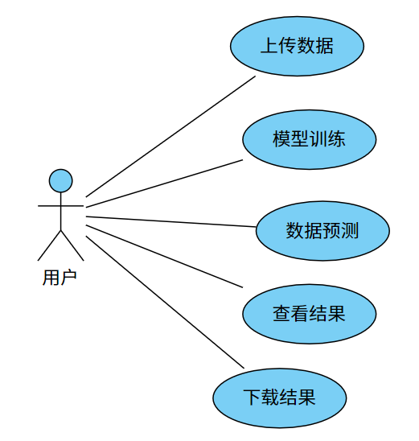

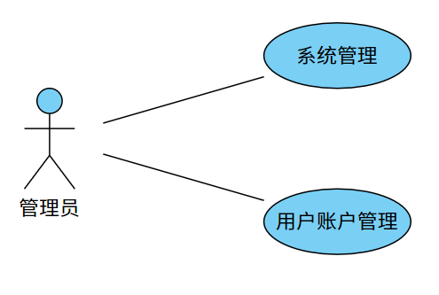

### 2.5 时序图

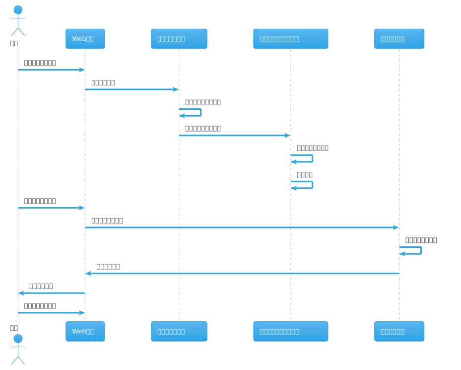

### 2.6 质量场景

#### 2.6.1 性能场景：

在分布式系统故障诊断系统中，性能是确保系统稳定运行和提供实时反馈的关键因素。我们关注于减小模型训练和预测的时间，以及优化数据处理和结果可视化的速度，以便在保证精确度的同时提供高效的用户体验。

1. **快速响应查询请求**

   用户在进行故障数据查询操作时，系统的响应时间≤60秒，即从用户发起查询请求到显示查询结果的时间不超过60秒，确保流畅的用户体验。

2. **高并发处理能力**

   平台应具有出色的并发处理能力，能够在支持至少1万用户同时进行操作的情况下稳定运行，无出现崩溃或者明显卡顿的情况。

3. **友好的加载与等待提示**

   如果由于网络延迟、数据库处理繁忙或其他任何原因导致系统不能在预定的时间（例如，1秒）内响应，系统将向用户显示“系统正忙”的提示，并提供一个进度条或类似的界面元素来可视化等待时间，避免用户在无反馈的情况下长时间等待。

性能的描述表如下所示：

| 场景     | 可能的值                                             |
| -------- | ---------------------------------------------------- |
| 刺激源   | 用户、系统管理员                                     |
| 刺激     | 提交数据进行训练、请求模型预测、访问数据和结果       |
| 制品     | Web前端、数据处理模块、机器学习模型、结果可视化模块  |
| 环境     | 高并发的网络环境、大数据处理、机器学习模型训练和预测 |
| 响应     | 数据处理、模型训练和预测、结果返回和可视化           |
| 响应度量 | 数据处理时间、模型训练/预测时间、结果可视化时间      |

性能一般场景表示：

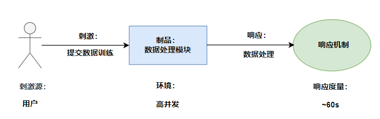

#### 2.6.2 安全性场景

在分布式系统故障诊断平台中，安全性是核心的关注点。以下是我们为确保数据安全而采取的措施。

1. **数据传输与存储的加密**

   为确保故障数据和标签数据在传输和存储过程中的完整性和机密性，我们使用了如SSL/TLS等先进的加密协议。这确保了在数据传输过程中，数据是加密且受保护的，防止中间人攻击和数据泄露。

2. **数据存储加密**

   数据在存储时也进行了加密处理，确保即使数据被非法获取，也难以被解析和使用。

3. **身份验证与授权**

   为保证数据安全，我们强化了身份验证和授权机制。只有经过验证并被授权的用户才能访问关键数据。当系统检测到异常登录频率或其他可疑行为时，会自动封锁账号并通过邮件通知用户。

4. **数据访问锁定机制**

   当多用户同时对系统进行检索查找时，为保证数据的一致性和有效性，系统会上锁关键数据条目，确保不会有多个进程同时对数据进行写操作。

可用性的描述表如下所示：

| 场景     | 可能的值                                                 |
| -------- | -------------------------------------------------------- |
| 刺激源   | 未授权用户、网络攻击者                                   |
| 刺激     | 未授权的数据访问、数据篡改                               |
| 制品     | 数据存储区、机器学习模型                                 |
| 环境     | SSL加密的网络连接、数据上传和下载                        |
| 响应     | 阻止未授权访问、启动加密协议、生成安全报告               |
| 响应度量 | 阻止的未授权访问次数、成功的数据加密率、安全事件响应时间 |

安全性一般场景表示：

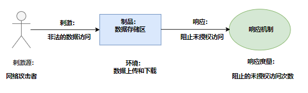

#### 2.6.3 易用性场景

在分布式系统故障诊断系统中，我们专注于创建一个直观的用户界面，包括自解释的UI元素，以及可视化的数据输出。我们致力于实现一个用户友好的交互环境，确保界面直观易懂，且用户交互过程无需额外解释或教程。

**1. 用户数据缓存**

当用户在7天内有过登录记录时，系统将保存用户的个人权限信息，提供自动登录以及自动恢复上次上传数据等功能，命中失败率低于1% 。

**2. 内容动态渲染**
利用JSP和Servlet等J2EE技术进行内容的动态渲染，以满足不同用户的个性化需求，并确保用户的每一次操作都能获得及时与准确的反馈。

**3. 用户界面分离设计**
实施用户界面的分离设计，使得前端展示和后端数据处理相互独立，不仅提升了界面响应速度，也保证了在后端处理延迟时，用户界面依然可以正常交互，防止出现卡顿或崩溃。

**4. 用户主动干预**
允许用户在操作过程中进行主动干预，例如：

- 取消正在进行的操作
- 撤销刚刚的操作
- 将多个操作步骤进行聚合 这样做增强了平台的灵活性，并提高了用户的操作自由度。

易用性的描述表如下所示：

| 场景     | 可能的值                                   |
| -------- | ------------------------------------------ |
| 刺激源   | 用户、系统管理员                           |
| 刺激     | 登录、上传数据、启动模型训练、查看训练结果 |
| 制品     | 用户界面、错误提示                         |
| 环境     | 在线Web平台、移动设备                      |
| 响应     | 简化操作流程、清晰的界面指导、自动问题恢复 |
| 响应度量 | 用户报告的问题数量、平均任务完成时间       |

易用性一般场景表示：

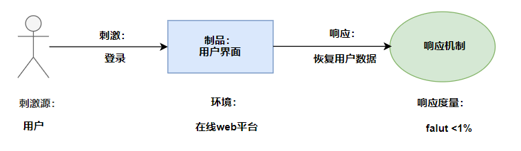

#### 2.6.4 可用性场景

在分布式故障诊断子系统的运作中，保障其在核心工作时间内的高可用性成为一项关键任务。以下是我们为确保系统可用性所采取的具体策略和实施细则：

**1. 自动警告和通知机制**
当系统内部发生错误或异常时，子系统自动触发警告机制，向管理员或相应的责任人发送实时通知，确保能够及时采取相应的措施来防止系统停机，并保障其持续正常运行。

**2. 自我诊断与错误记录**
子系统能够自动诊断一系列的常见问题，并在内部日志中记录相应的错误信息，以便于后续的问题追踪和系统优化。

**3. 网络连接的自动恢复**
对于网络连接问题，子系统将：

- 自动尝试重新建立连接；
- 在连续多次尝试失败后，向管理员发送通知，请求其进行手动干预。

**4. 模型训练的自我修复**
当模型训练过程中出现失败的情况时，子系统将：

- 自动尝试使用替代的算法或参数进行再次训练；
- 在多次尝试后仍未成功，则将相关信息记录在内部日志中，并向管理员发出通知，便于进一步分析处理。

可用性的描述表如下所示：

| 场景     | 可能的值                                                     |
| -------- | ------------------------------------------------------------ |
| 刺激源   | 系统用户、外部设备、数据库、网络                             |
| 刺激     | 错误：数据库连接失败、外部设备故障、无响应、错误的数据输入   |
| 制品     | 服务器、数据库、通讯接口、用户界面                           |
| 环境     | 正常操作、高并发、设备维修时                                 |
| 响应     | 系统应检测故障，并进行以下活动之一或多个：记录错误日志、通知管理员、重新连接数据库 |
| 响应度量 | 系统正常运行时间、系统恢复时间、故障发生频率                 |

一般表示为：

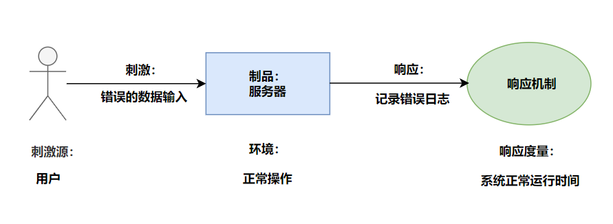

#### 2.6.5 可修改性场景

系统为用户提供了灵活性和可定制性，使其能够根据特定需求对展示界面、故障诊断模型以及数据处理模块进行细致的修改和优化。具体的修改和优化空间包括但不限于以下几方面：

**1. 展示界面定制**
用户可以根据自己的喜好和需求对数据展示结果界面进行多方面的定制，包括：

- 调整布局排版；
- 选择和修改色彩方案；

**2. 故障诊断模型优化**
用户拥有自主优化故障诊断模型的权限，以便：

- 提升模型的准确度；
- 适配特定的应用场景；

**3. 数据处理模块的适配与修改**
系统允许用户对数据处理模块进行灵活的修改，以便：

- 优化数据处理流程；
- 提高数据处理效率。

可用性的描述表如下所示：

| 场景     | 可能的值                                           |
| -------- | -------------------------------------------------- |
| 刺激源   | 用户、系统开发者                                   |
| 刺激     | 个性化定制、新增功能                               |
| 制品     | 机器学习模型、用户界面、数据处理模块               |
| 环境     | 正常操作、开发阶段、系统升级期间                   |
| 响应     | 系统应支持快速修改和扩展                           |
| 响应度量 | 系统正常响应时间、新功能部署时间、系统升级停机时间 |

可修改性一般场景表示：

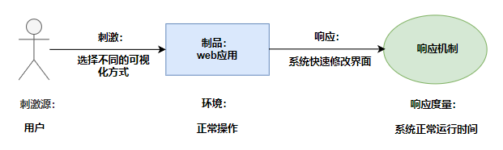

#### 2.6.6可移植性场景

系统的模块化设计提供工具和接口，允许我们在未来轻松添加新功能或进行技术升级，同时支持用户在不同版本的系统之间迁移数据和模型。

可移植性一般场景表示：

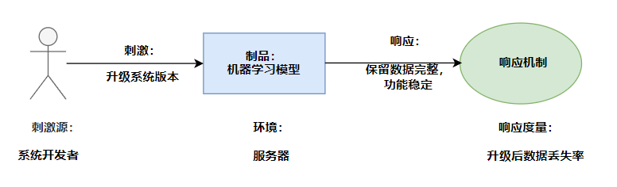

## 三、架构设计

### 3.1 样式选择、参考模型、参考架构

#### 3.1.1 样式选择：

分布式系统故障诊断系统参考分层架构样式，在水平方向把系统分割成相互连接的多个层次，即层次模型。每一层都包含系统的一个抽象形式的子任务下层为上层提供服务（service）并为上层的调用返回结果，即下层的功能是服务于上层的。

#### 3.2.2 参考模型

分布式系统故障诊断系统采用Layered Architecture架构风格，使用Django+Bootstrap框架设计了一个响应式的用户界面，训练模型采用PyTorch框架开发，该框架因其灵活性和动态计算图而被广泛应用于深度学习研究和开发。

系统的参考模型如下：

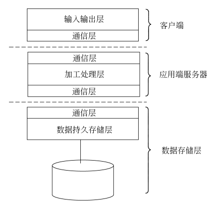

#### 3.3.3 参考架构

参考架构如下：

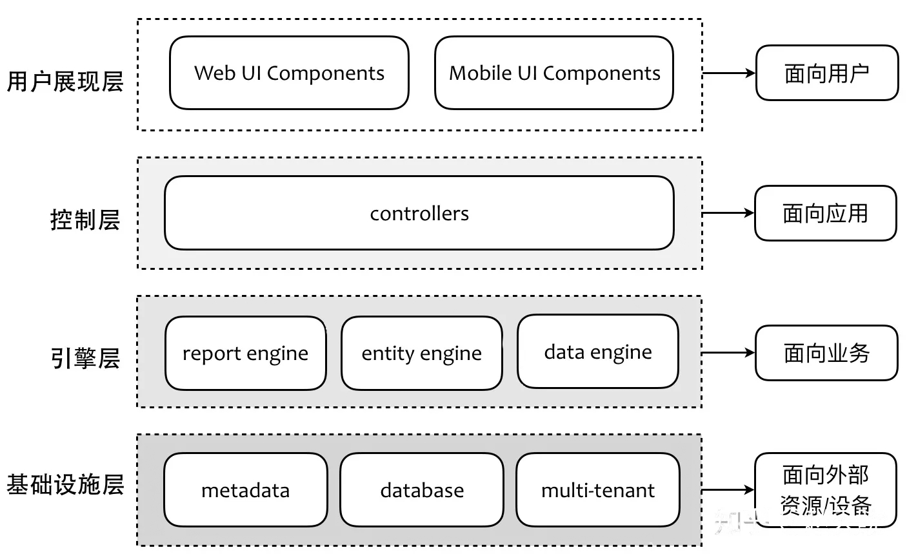

### 3.2 体系结构的设计

`SystemHealer`的设计遵循了**模块化(Modularity)**和**层次化(Hierarchical Decomposition)**的软件工程原则，目的在于创建一个可扩展和易于维护的系统。模块化确保了系统中的每个模块或组件都有一个明确且单独的职责，这不仅增强了组件的可重用性，还提高了系统的整体可靠性。通过层次化的设计，我们将系统分解为多个逻辑层，每层都为其上一层提供了抽象化的服务。

参考模型基于典型的机器学习工作流程，它包括了以下几个关键阶段：数据预处理（其中涉及特征工程、缺失值处理、数据标准化等），模型训练（使用各种优化算法和技术进行参数调整），故障诊断（利用已训练的模型进行预测和分类）以及Web平台交互（提供用户友好的界面来上传数据、查看结果等）。

为了确保系统的高伸缩性、弹性和故障容错性，我们采用了微服务架构作为参考架构。在微服务架构中，每个功能模块都被设计为一个独立的、松耦合的服务，这些服务之间通过轻量级的通信协议（如RESTful API或gRPC）进行交互。每个微服务可以独立地部署、扩展和更新，这大大提高了系统的敏捷性和可维护性。此外，使用容器化技术（如Docker）和容器编排工具（如Kubernetes）可以进一步提高系统的部署和运行效率。

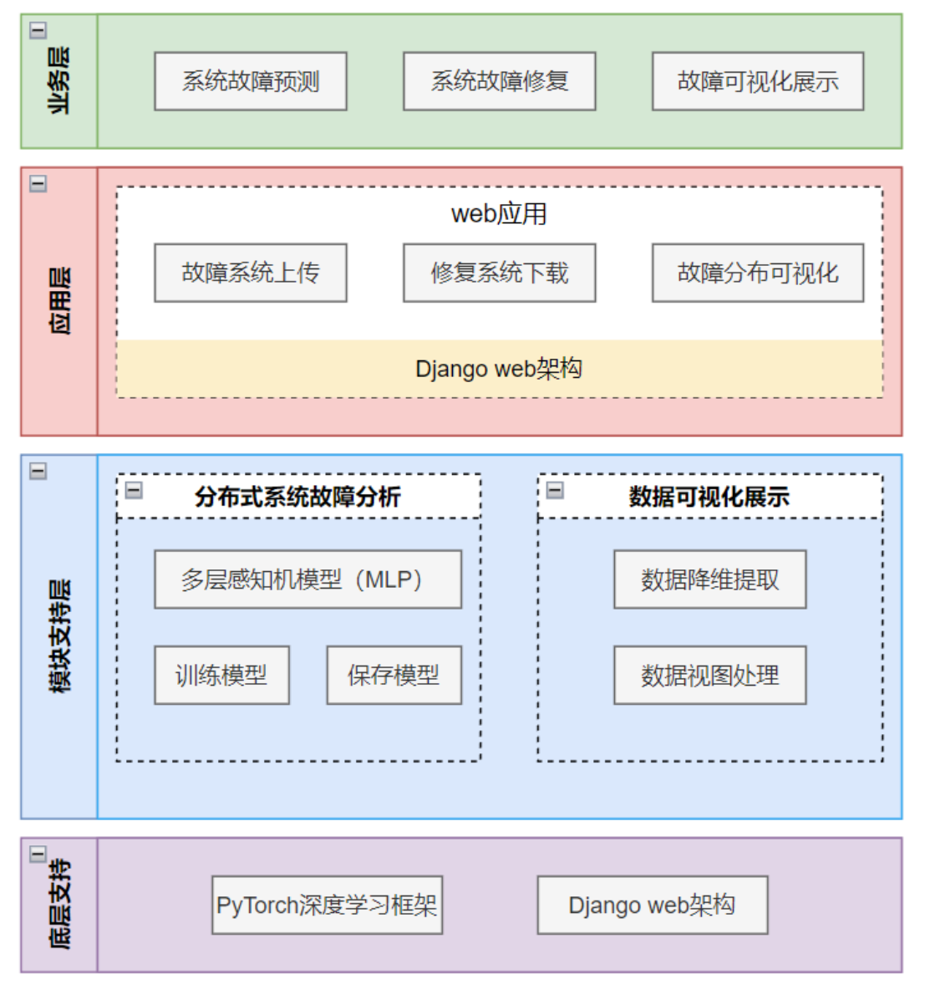

### 3.3 系统架构的分析与设计

在构建`SystemHealer`的系统架构时，我们采用了一种综合的方法论，结合了领域驱动设计（Domain-Driven Design, DDD）和微服务架构原则，以确保系统在满足高效故障诊断的同时，也能为用户提供流畅且高响应的交互体验。

核心的设计目标是确保每个功能模块或组件都具有单一职责原则（Single Responsibility Principle, SRP），这样不仅可以保证模块的高内聚性，还能降低各模块之间的耦合度。因此，我们设计每个模块为一个独立的服务，这些服务在运行时都可以并发处理请求，从而实现负载均衡和高并发处理能力。此外，为了确保服务间的隔离性和故障的局部性，我们采用了容器化技术（如Docker），使得每个服务都运行在独立的容器中。

选择微服务架构作为`SystemHealer`的基础架构，是因为它具有一系列的优势：首先，它允许独立部署和扩展每个服务，这大大提高了系统的伸缩性和故障恢复能力。其次，微服务架构支持多种编程语言和技术栈的混合使用，从而提供了更大的灵活性和选择余地。再者，与传统的单体应用相比，微服务更容易进行持续集成和持续部署（CI/CD），从而加速软件的交付速度。

为了确保服务之间的高效通信，我们采用了轻量级的通信协议，如RESTful API和gRPC，同时引入了API网关来统一管理服务间的请求和响应。此外，为了处理异步事件和确保数据的一致性，我们还使用了事件驱动架构和消息队列（如Kafka）。

系统的目标及实现方法如下：
| 目标 | 实现方式                                                     | 所采用的战术                                                 |
| ---- | ------------------------------------------------------------ | ------------------------------------------------------------ |
| 性能 | 1. 在进行大规模的数据处理和机器学习模型训练时，系统应确保其他功能（如数据上传、查询等）的正常运行，不被大数据处理任务影响。 2. 用户提交的数据处理和机器学习模型的训练/预测结果应在用户可接受的时间范围内返回。 3. 在高并发的网络环境下，系统能够稳定运行，满足多用户的数据处理和模型训练/预测请求。 | 使用队列管理数据处理和模型训练的请求，确保系统资源的合理利用。 利用缓存技术来存储数据处理和模型训练/预测的中间结果，减少重复计算。  使用分布式数据处理和计算技术来提高系统的处理能力和可扩展性。 利用负载均衡技术来均匀分配用户请求，防止部分服务器过载。 |

### 3.4 架构演进规划

在一个快速变化的技术环境中，任何系统都需要不断地演进以适应新的业务需求和技术挑战。`SystemHealer`也不例外。我们的目标是确保系统架构的适应性、弹性和可扩展性，从而为持续的创新和增长打下坚实的基础。

1. **引入先进的机器学习算法**：随着机器学习和深度学习领域的不断发展，新的算法和技术不断涌现。我们计划在未来的版本中，引入如卷积神经网络（CNN）、循环神经网络（RNN）以及强化学习等先进技术，以提高故障诊断的准确性和效率。
2. **优化数据处理流程**：数据是机器学习的基石。为了确保数据质量和处理效率，我们计划进一步优化数据的ETL过程，引入数据湖和大数据处理技术如Apache Spark和Apache Flink，以支持更大规模的数据处理和实时分析。
3. **增强Web平台的功能与用户体验**：为了满足用户更多样化的需求和提供更好的使用体验，我们计划对Web平台进行全面的升级。这包括但不限于：增强的数据可视化工具、更加直观的交互界面、支持更多的自定义功能以及引入用户反馈机制，以收集用户的意见和建议。
4. **云原生和微服务优化**：考虑到云计算和微服务架构的趋势，我们还计划对现有架构进行进一步的优化，采用Kubernetes进行容器编排，引入服务网格技术如Istio进行微服务的管理和监控，从而确保更高的系统可用性和弹性。
5. **安全与合规**：随着数据隐私和安全的重要性日益增强，我们计划引入更严格的数据加密和访问控制机制，并遵循如GDPR和CCPA等国际数据保护法规。

### 3.5 小结

`SystemHealer`不仅仅是一个机器学习应用，而是一个专为分布式系统故障诊断而设计的综合性解决方案。它结合了领域驱动设计（Domain-Driven Design, DDD）和最新的机器学习技术，以识别、分析和解决分布式系统中可能出现的各种问题。

其核心设计理念基于模块化和层次化的结构，以确保系统的各个部分都可以独立、高效地运行。这种结构不仅提高了系统的可靠性，还为未来的扩展和维护提供了便利。通过使用微服务架构，每个功能模块都可以独立地部署和扩展，从而提供了出色的伸缩性和弹性。

此外，`SystemHealer`还重视数据驱动的决策制定。采用先进的数据预处理和分析技术，以确保机器学习模型能够在真实、复杂的环境中准确地工作。

随着业务和技术环境的持续变化，`SystemHealer`也将继续进行演进。无论是引入更先进的机器学习算法，还是优化系统架构和用户体验，我们都致力于确保`SystemHealer`始终处于行业的前沿，满足客户日益增长的业务需求。