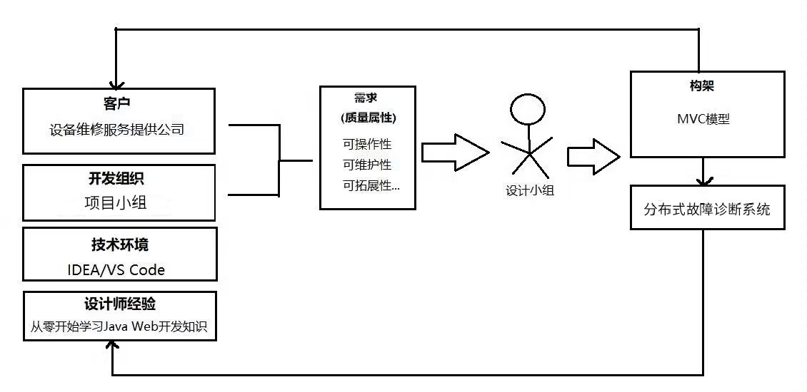
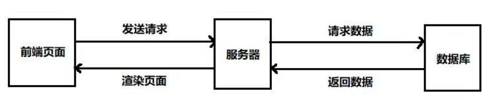

   
    <h1>基于机器学习的分布式系统故障诊断系统</h1>
    <h3>架构评审文档</h3>

## 一、ATAM方法表述

### 1.1 概述
**ATAM**（Architecture Tradeoff Analysis Method）是由SEI提出的一种软件构架评估方法。ATAM评估方法主要围绕以下目标展开：
1. 精确描述软件的质量属性需求；
2. 精确描述构架设计决策；
3. 评估这些构架设计决策，并判定其是否满意地实现了这些质量需求。

ATAM评估方法并不是对每个可以量化的质量属性进行详尽的分析，而是让众多风险承担者（包括经理、开发人员、测试人员、用户、客户等）参与其中，以达到上述目标。ATAM注重挖掘潜在风险，降低或缓和现有风险的方法。在评估过程中，特别注重以下三点：风险、敏感点和权衡点。

### 1.2 构架涉众
- **用户**：系统的实际使用者，关心系统的功能和性能；
- **管理员**：负责系统的部署、配置和日常运维；
- **开发人员**：负责系统的设计和开发，关心架构的合理性和可维护性；
- **测试人员**：负责系统的质量保障，关心测试的便利性和覆盖面。

## 二、商业动机的描述

项目经理从开发组织和客户的角度表述“基于机器学习的分布式系统故障诊断系统”的商业目标，综合如下：

- **从开发组织角度**：开发一个模块化强、实时分析高效、用户界面友好、与外部其他系统兼容良好的分布式故障诊断系统。这使得开发组织能够将整个产品或其某个模块销售给其他客户，同时由于优秀的界面设计和高效的故障处理能力而受到市场的欢迎。
- **从客户角度**：系统操作简便，具有良好的可维护性和稳定性，能够及时且准确地处理分布式系统故障的诊断和分类等操作，从而降低运维难度，减少人力资源消耗，并提升系统的整体稳定性。

根据上述目标，质量属性可以划分为两类：

- 高优先级质量属性：
  - **性能**：系统应具有高效的故障数据处理和分析能力；
  - **安全性**：确保故障数据的安全存储和传输；
  - **可用性**：系统在多种环境下稳定运行；
  - **可维护性**：系统应易于升级和维护；
  - **易用性**：用户界面应直观易操作。

- 重要但优先级较低的属性：

  - **模块性**：系统各模块之间解耦合，支持灵活配置和拓展；
  - **可修改性**：系统能够方便地进行功能调整和扩展；

  - **可测试性**：支持各层级的测试，保障系统质量。

## 三、构架表述

#### 3.1 与构架商业周期的关系

#### 3.2 系统的整体结构

#### 3.3 质量属性及采用的战术
| 目标         | 实现方式                                                     | 所采用的战术                                                 |
| ------------ | ------------------------------------------------------------ | ------------------------------------------------------------ |
| **性能**     | ①在进行故障数据查询操作时，响应时间≤60秒。 ②服务器支持高并发，1万用户同时操作而不崩溃。 ③如果由于网络或数据库等原因不能在规定时间（1s）内做出反应，系统应提示“系统正忙”并提供进度条等待等提示，避免用户无故长时间等待。 | 并发创建索引 缓冲池技术 异步处理查询请求 限制访问队列大小（限定服务器同时处理不超过1千用户的请求，如果服务器满载而有新的用户请求则让其等待，如果等待时间超过一分钟则提示用户链接服务器超时。） |
| **安全性**   | ①当多用户同时使用系统进行检索查找时，为保持数据的一致性、有效性，上锁关键数据条目，保证不会有多个进程同时对数据进行写操作。 ②为防止非法访问，当检测到异常登录频率后封锁账号，并邮件通知用户。 ③在web数据库客户端、web服务器和数据库服务器之间设置防火墙，阻挡非法数据请求和网络攻击。 | 身份验证（例如，记录用户登录的IP地址和地理位置，如果登录地理位置与上一次相差过大，则通过邮件提醒用户） 授权（例如，在新设备登录时向用户绑定的邮箱或手机发送授权链接。） 验证码（例如，登录时要求输入验证码，并有验证码输入的冷却时间。） 锁机制（例如，不允许在不同设备或网页上同时登录同一账号。） |
| **易用性**   | ①利用JSP和Servlet等J2EE技术支持内容渲染，以满足不同用户需求。用户对系统的操作能得到正确及时的反馈。 ②记录检索提供多种排序筛选方式。搜索后的结果可以以多种方式排列，如卡片式、条式、九宫格格式等。 | 分离用户接口 支持用户主动（取消、撤销、聚合） 用户模型 |
| **可用性**   | ①系统必须进行错误检测，当尝试超出限制范围进行操作时拋出异常，中止进一步的错误操作。当系统崩溃时，自动发送错误信息给管理员。 ②为了快速修复和给用户提示，系统提供了可以使用的事务服务，通过提供内建的故障恢复机制，提高了应用的可用性和可靠性。 | 异常检测 错误日志记录 业务最大并发数控制 后台模块可用性控制 冗余 |
| **模块性**   | 系统功能划分为几个模块，满足“松耦合高内聚”的设计原则。       | 模块划分                                                     |
| **可测试性** | 在完成系统开发的一个增量后，能较轻松的对软件进行测试。       | 管理输入/输出 内部监视                                    |
| **可修改性** | 在变更到达时，系统在时间和预算内完成测试和部署的变更。       | 局部化修改 防止连锁反应 推迟绑定时间                   |
| **可维护性** | 选择易于维护的程序设计语言                                   | 采用先进的工具 着重对可维护性进行复审 详细的日志记录 改进程序文档 建立明确的软件质量目标 使用先进的软件开发技术和工具 进行明确的质量保证审查 |

## 四、质量属性效用树

| 质量属性     | 属性求精           | 场景编号 | 场景                                                         |
| ------------ | ------------------ | -------- | ------------------------------------------------------------ |
| **性能**     | 最大负载           | XP01     | 当系统部署在分布式环境中时，能够支持至少2000个节点的实时故障检测和分类（H,H） |
| **性能**     | 响应时间           | XP02     | 在故障检测和分类过程中，每个节点的响应时间在2秒以内，如果超时，给出友好的提示。(H,M) |
| **性能**     | 吞吐量             | XP03     | 系统可以保证同时处理1000个节点的故障数据。在高负载时，应该能够处理1万节点的数据(H,H) |
| **安全性**   | 数据存储           | AQ01     | 系统将故障数据加密后存入数据库；在数据传输过程中确保数据的完整性和保密性，防止被窃取泄露。（H,L） |
| **安全性**   | 防止恶意攻击       | AQ02     | 系统防护措施应能阻挡非法用户直接访问数据库；屏蔽某IP短时间内的大量无意义的访问，防止服务器被挤爆导致正常用户无法使用。(H,M) |
| **安全性**   | 封闭性             | AQ03     | 对局域网外的访问进行控制，不能直接访问数据库，并阻止非法修改。(H,M) |
| **安全性**   | 界面友好，易于操作 | YY01     | 界面应直观，即使是只具有基本机器学习和系统管理知识的人员，也能够根据界面快速学会使用方法。(M,M) |
| **安全性**   | 及时响应           | YY02     | 在进行故障数据查询时，能够在2s内得到诊断和分类的结果。(H,M)  |
| **可用性**   | 容错性             | KY01     | 系统能够容忍用户或节点在使用过程中的正常错误，并且能够从错误中恢复，保证系统稳定运行。(M,M) |
| **可用性**   | 备份与恢复         | KY02     | 数据库每10个小时备份一次，系统能在一个小时内恢复崩溃。（H,M） |
| **模块性**   | 模块职责划分明确   | MK01     | 系统自上而下划分为：系统-子模块-模块子模块（H,M）            |
| **模块性**   | 接口清晰           | MK02     | 模块之间通过清晰定义的API进行通信。（H,L）                   |
| **可测试性** | 类的测试           | CS01     | 每个类及其方法都应该经过单元测试，以验证其正确性。(M,L)      |
| **可测试性** | 系统功能模块测试   | CS02     | 对与系统功能相对应的模块进行集成测试，以保证业务的完备性。(M,M) |
| **可修改性** | 维护管理           | XG01     | 管理员能够在节点信息、故障模型需要更新时进行及时更新，并同步数据反馈给用户。（H,M） |
| **可修改性** | 文档完备           | XG04     | 各个模块和系统必须提供详细可读的文档，以便维护人员维护。（H,L） |

注：H = 高, M = 中, L = 低

## 五、质量场景的架构分析

评估小组首要对最重要和最难实现的场景，即标注为（H，H）的场景进行分析。在质量评估效用树中，仅在性能这个质量属性下有标注为（H，H）的场景，下面根据系统的体系结构和实现质量属性所采用的战术给出其中一个重要场景的构架方法分析表格。

|              场景号:XN01               | 场景:系统的访问量达到高峰  | 场景:系统的访问量达到高峰 | 场景:系统的访问量达到高峰 | 场景:系统的访问量达到高峰 |
| :------------------------------------: | :------------------------: | :-----------------------: | :-----------------------: | :-----------------------: |
|                  属性                  |            性能            |                           |                           |                           |
|                  环境                  |     系统处于高负载状态     |                           |                           |                           |
|                  刺激                  | 更多用户向系统发出访问请求 |                           |                           |                           |
|                  响应                  |    尽快地响应用户的请求    |                           |                           |                           |
|                构架决策                |           敏感点           |          权衡点           |        有风险决策         |        无风险决策         |
|              云服务器分流              |             S1             |                           |                           |            N1             |
|                  缓存                  |             S2             |                           |            R1             |                           |
|              数据库连接池              |             S3             |                           |                           |            N2             |
| 每个IP在单位时间 内只允许发出一个 请求 |                            |            T1             |            R2             |                           |
|  超出限制的访问请 求放入队列进行等 待  |             S4             |                           |            R3             |                           |
|              并发创建索引              |                            |            T2             |            R4             |                           |
- 推理  

  - 1.当服务器的访问量过大时,可以将部分访问请求分流到云服务器,减轻服务器 的负载量,提高用户请求处理的效率; 

  - 2.将历史上访问量高的数据放在缓存中,但是单个服务器的缓存数有限;

  - 3.减轻数据库的负担,提高系统的性能;

  - 4.限制用户的访问频率,避免非法用户的恶意攻击,但可能降低系统可用性; 

  - 5.尽管存在云服务器分流,但服务器的负载是有限的,对最大访问量限制,保证 系统正常运行,但超出访问量的用户将无法访问系统,降低了用户的满意度; 

  - 6.使用并行索引访问数据库,但服务器访问量大时,并行索引可能会带来更严重 的资源争用,降低系统的安全性;

## 六、对系统构架的再分析

#### 6.1 风险决策和敏感点

| 采用战术         | 敏感点（S）                            | 有风险决策（R）                                              |
| ---------------- | -------------------------------------- | ------------------------------------------------------------ |
| 分布式存储       | 提高了系统对大规模数据的存储和访问能力 | 分布式存储中的数据同步和一致性问题可能影响系统的准确性和实时性 |
| 并行计算         | 通过并行计算提高了故障检测和分类的效率 | 在大规模并行计算时，资源的分配和调度、计算节点的同步和通信可能成为性能的瓶颈 |
| 机器学习模型优化 | 提高了故障检测和分类的准确性           | 需要大量的计算资源和数据，且模型的训练和优化时间可能较长     |
| 数据加密         | 保护数据在传输过程中的安全性           | 加解密操作可能消耗额外的计算资源，影响系统性能               |

#### 6.2 问题分析

在之前对系统结构的描述中，系统采用的是一个分布式的机器学习模型来进行大规模的故障诊断。在构架方法分析中，小组对性能、可扩展性和准确性等质量属性进行了分析。存在的问题包括：在大规模节点上进行实时故障检测和分类时，可能会由于数据通信、同步和计算资源分配等问题导致系统性能下降。同时，机器学习模型的训练和优化需要大量的计算资源和时间，可能影响到系统的准确性和实时性。

#### 6.3 改进系统的构架

考虑到在分布式环境中进行大规模故障诊断的挑战，我们可以采用以下策略对现有构架进行改进：
- **优化数据通信和同步**：通过优化数据的分片策略和通信协议，减少数据传输的延迟和冗余，提高系统的实时性和准确性。
- **动态资源分配和调度**：根据系统的实时负载和计算需求动态分配计算资源，平衡各计算节点的负载，避免计算瓶颈。
- **模型简化和硬件加速**：探讨是否可以简化机器学习模型，减少模型的计算复杂度；同时，考虑使用GPU等硬件加速手段提高模型的计算效率。
- **安全性提升**：加强对数据在存储和传输过程中的加密措施，提高系统的安全性。

这些改进策略需要在后续的架构设计和实现过程中进一步讨论和细化，以确保它们能够有效解决上述分析出的问题，并进一步提升系统的性能和可靠性。

## 七、评审结论

经过深入的评审和分析，我们的团队针对“基于机器学习的分布式系统故障诊断系统”在多个质量属性场景下（包括性能、可扩展性、准确性和安全性等）发现了一些初始架构方案中可能存在的问题和风险。特别是在处理大规模分布式环境中的故障检测和分类时，我们识别到了数据通信、同步、计算资源分配和模型计算效率等方面的挑战。

我们采取了一系列的战术和策略，如优化数据通信和同步策略、动态的资源分配和调度、机器学习模型的简化和硬件加速以及加强数据的安全性等，来改进我们的架构方案。这些改进目标在于更有效地支持大规模分布式环境下的实时故障检测和分类，同时确保系统的准确性、安全性和可用性。

通过这些架构的改进和优化，我们相信新的架构方案能够更加符合项目的质量属性需求，提供更加稳定、可靠和高效的故障诊断服务，在实际应用中更好地满足用户和业务的需求。在未来的项目实施过程中，我们将持续关注架构的实际表现，并根据实际情况进行进一步的调整和优化，确保项目的成功实施。

