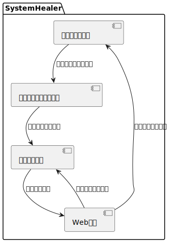
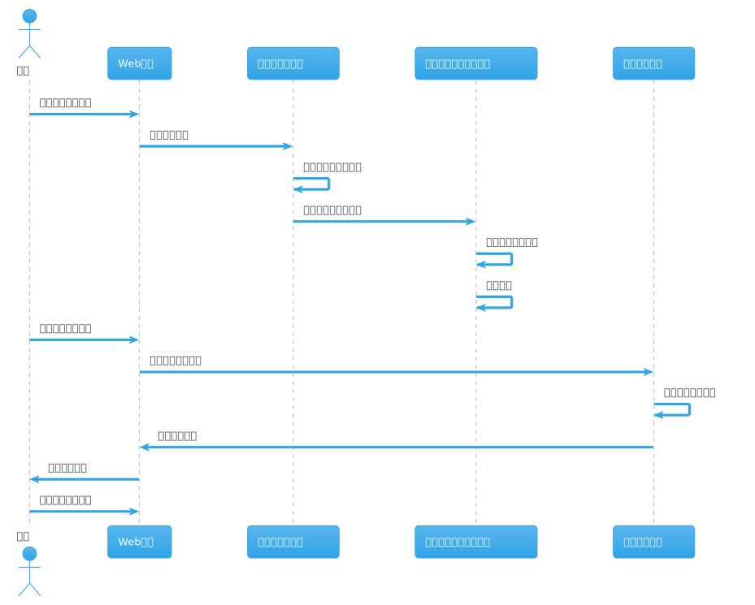
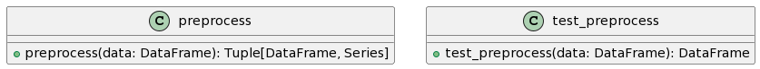
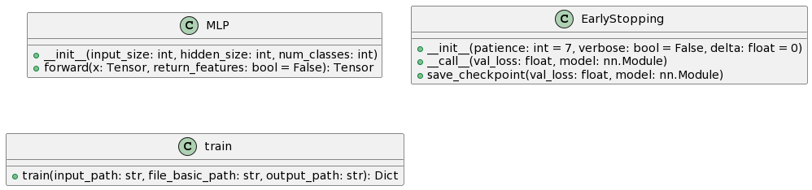
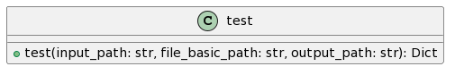

<div align = "center">   
    <h1>基于机器学习的分布式系统故障诊断系统</h1>
    <h3>系统设计文档</h3>
</div>
## 1. 项目概述

### 1.1 项目背景

在大数据时代，分布式系统已经成为信息存储和处理的主流系统。由于其庞大和复杂的特性，分布式系统的故障发生的平均几率较高，运维的难度和复杂度也大大提高。如何对分布式系统进行高效、准确的运维，成为保障信息系统高效、可靠运行的关键问题。

`SystemHealer(系统治愈师)`项目是一个基于机器学习的分布式系统故障诊断系统，它的目标是通过对分布式系统的故障数据进行分析，设计故障诊断模型，高效地分析并识别故障类别，实现分布式系统故障运维的智能化，快速恢复故障的同时大大降低分布式系统运维工作的难度，减少运维对人力资源的消耗。

### 1.2 项目目标

`SystemHealer`的主要目标是：

1. 利用机器学习技术，对分布式系统的故障数据进行深度分析，设计并实现故障诊断模型。

2. 通过故障诊断模型，能够高效地分析并识别分布式系统的故障类别，实现分布式系统故障运维的智能化。

3. 构建一个用户友好的Web平台，该平台支持用户上传训练数据并在线训练，训练完成后可下载训练模型。同时，该平台支持单条或者批量测试样本上传，并可视化分类结果，同时支持下载分类结果。

4. 通过提高故障诊断的准确性和效率，快速恢复故障，大大降低分布式系统运维工作的难度，减少运维对人力资源的消耗。

## 2. 系统架构

### 2.1 系统组件

`SystemHealer`项目主要由以下几个关键组件构成：



1. **数据预处理模块**：这个模块负责对原始的故障数据进行预处理，包括数据清洗、特征选择等，以便于后续的机器学习模型训练。

2. **机器学习模型训练模块**：这个模块负责使用预处理后的数据训练机器学习模型。模型训练完成后，可以用于后续的故障诊断。

3. **故障诊断模块**：这个模块负责使用训练好的机器学习模型对新的故障数据进行诊断，识别出故障的类别。

4. **Web平台**：这是一个用户交互界面，支持用户上传训练数据进行模型训练，也支持用户上传测试数据进行故障诊断。同时，该平台还提供了数据可视化功能，可以直观地展示诊断结果。

### 2.2 系统流程

以下是`SystemHealer`项目的主要工作流程：



1. **数据预处理**：首先，用户通过Web平台上传原始的故障数据。数据预处理模块接收到数据后，进行数据清洗和特征选择等预处理操作。
2. **模型训练**：预处理后的数据被送入机器学习模型训练模块。该模块使用这些数据训练出一个故障诊断模型，并将模型保存下来，供后续使用。
3. **故障诊断**：当有新的故障数据需要诊断时，用户可以通过Web平台上传这些数据。故障诊断模块接收到数据后，使用之前训练好的模型对这些数据进行诊断，识别出故障的类别。
4. **结果展示**：诊断结果会被送到Web平台上，通过数据可视化的方式展示给用户。用户也可以选择下载诊断结果。

## 3. 系统实现

### 3.1  **数据预处理模块**：

这个模块负责对原始的故障数据进行预处理，包括数据清洗、特征选择等，以便于后续的机器学习模型训练。在我们的Python代码中，这个模块由两个函数`preprocess`和`test_preprocess`实现。`preprocess`函数接收一个`DataFrame`类型的数据作为输入，进行去重、缺失值填充和标准化等预处理操作，然后返回处理后的数据和对应的标签。`test_preprocess`函数则用于处理测试数据，它只进行缺失值填充和标准化操作。

同时，为了确保模块的高性能和可靠性，我们采取了以下战术策略：

- **异步处理和队列管理**：我们采用异步处理机制和队列管理技术来处理数据处理请求。通过将数据处理任务放入队列，并利用异步处理机制，我们能够有效地管理处理流程，确保系统在高负载条件下仍能保持良好的性能。
- **异常处理机制**：为了确保数据处理的可用性和可靠性，我们实施了健壮的异常处理机制。任何在数据处理过程中出现的异常都将被捕获并记录，以便团队能够及时地诊断和修复问题。



### 3.2  **机器学习模型训练模块**：

这个模块负责使用预处理后的数据训练机器学习模型。模型训练完成后，可以用于后续的故障诊断。在我们的Python代码中，这个模块由`MLP`类和`train`函数实现。`MLP`类定义了一个多层感知机模型，包括模型的初始化和前向传播过程。`train`函数则负责读取数据，进行数据预处理和模型训练，并保存训练好的模型。

为了确保模块能够满足性能要求，我们考虑采用分布式计算资源来进行模型的训练。通过利用分布式计算的优势，我们能够大大缩短模型训练时间，并在需要时，处理大规模的数据集。



### 3.3  **故障诊断模块**：

在实现故障诊断的过程中，为用户提供直观、高效和多交互的体验是至关重要的。我们的诊断模块专注于利用训练良好的机器学习模型处理新的故障数据，以准确地识别故障类别。为了进一步提升模块的易用性和响应性，我们采取了一系列战术策略，以实现快速的用户反馈和多样化的交互方式。

#### 快速用户反馈：

我们理解到，在处理故障诊断时，快速的反馈对于用户来说极为重要。因此，我们的`test`函数不仅仅是执行诊断操作，而是立即将诊断结果返回给用户。通过此设计，用户可以立即了解到诊断的状态和结果，从而作出相应的决策。

#### 多种交互方式：

除了基础的诊断功能外，我们还考虑了多种交互方式，以满足不同用户的需求。例如，我们可以提供一个图形用户界面(GUI)或者一个Web服务，让用户能够通过直观的界面上传测试数据、触发故障诊断操作，并实时查看诊断结果。此外，我们还可以提供API接口，为熟悉编程的用户提供更多的自定义选项。

#### 模块实现：

在我们的Python代码中，诊断模块由`test`函数实现。

- `test`函数：此函数负责读取测试数据，执行必要的数据预处理操作，然后利用训练好的机器学习模型进行故障诊断。在诊断完成后，`test`函数会保存诊断结果，并将结果快速反馈给用户。通过`test`函数，我们能够实现高效、准确的故障诊断，并为用户提供实时的反馈。

通过细心的设计和实现，我们的诊断模块不仅能够快速准确地识别故障类别，同时也提供了多种交互方式，以增强易用性和响应性。我们的目标是为用户提供一个强大而直观的工具，以帮助他们快速、准确地诊断和解决各种故障问题。



### 3.4  **Web平台**：

这是一个用户交互界面，支持用户上传训练数据进行模型训练，也支持用户上传测试数据进行故障诊断。同时，该平台还提供了数据可视化功能，可以直观地展示诊断结果。

## 4. 系统部署

###  4.1 使用脚本进行部署

在`SystemHealer/`目录运行`setup.sh`脚本，可以一键构建环境，脚本内容如下：

```shell
#!/bin/bash

# 安装 virtualenv
pip install virtualenv

# 创建虚拟环境
virtualenv venv

# 激活虚拟环境
source ./venv/bin/activate

# 安装依赖
pip install -r requirements.txt

# 迁移数据库
python3 manage.py migrate

# 运行服务器
python3 manage.py runserver


# 睡眠1s
sleep 1

# 打开浏览器并访问localhost:8000
xdg-open http://localhost:8000
```

### 4.2 使用 Docker 进行部署

在`SystemHealer/`目录写有`Dockerfile`文件:
```dockerfile
# 使用官方 Python 运行时作为父镜像
FROM python:3.8-slim-buster

# 设置工作目录
WORKDIR /app

# 将当前目录内容复制到容器的 /app 目录中
COPY . /app

# 安装项目需要的包
RUN pip install --no-cache-dir virtualenv && \
    virtualenv venv && \
    . ./venv/bin/activate && \
    pip install --no-cache-dir -r requirements.txt

# 运行迁移
RUN python3 manage.py migrate

# 使端口 8000 可供此容器外的环境使用
EXPOSE 8000

# 定义环境变量
ENV NAME SystemHealer

# 运行服务器
CMD ["python3", "manage.py", "runserver", "0.0.0.0:8000"]
```

然后，运行以下命令来构建 Docker 镜像：

```bash
docker build -t systemhealer .
```

最后，运行以下命令来启动 Docker 容器：

```bash
docker run -p 8000:8000 systemhealer
```

现在，您可以在浏览器中输入 `localhost:8000` 来访我们的Web系统。
